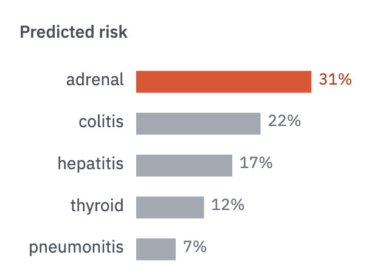

# 01 · Ranked bars

For named categories compared by one value, when their order is the story.

- Horizontal, sorted by value, with category names left of the baseline and values
  at the tips (no x-axis).
- One accent bar (the finding); the rest in `context`. If every bar matters equally,
  all bars are `ink`.
- Percentages are rounded to integers unless the difference lives in the decimal.



```js figure=main w=306 h=230
const ch = GA.chart(ga, { x: 112, y: 50, w: 186, h: 172, xd: [0, 0.4], yTitle: "Predicted risk", yTitleX: 16, axes: "" });
ch.hbars([
  { label: "adrenal", v: 0.31, color: "var(--accent)", valueColor: "var(--accent-text)" },
  { label: "colitis", v: 0.22 }, { label: "hepatitis", v: 0.17 }, { label: "thyroid", v: 0.12 }, { label: "pneumonitis", v: 0.07 },
], { fmt: (v) => `${Math.round(v * 100)}%` });
```
