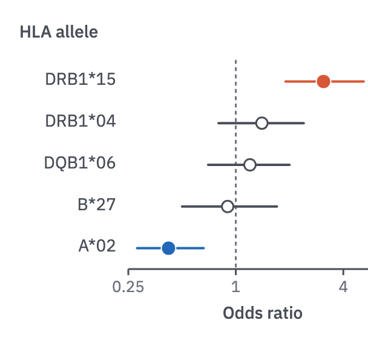

# 02 · Forest plot

For effect sizes with their confidence intervals, one row per variable.

- Use a log scale for ratios (OR, HR, RR), with ticks at 0.25, 1 and 4, or at
  0.5, 1 and 2.
- Draw a dotted null line at 1 (or at 0 for differences).
- A filled point means the CI excludes the null; a hollow point means it doesn't.
- Colour by direction when direction is the point: harm above 1, benefit below.
  Non-significant rows are `ink-2`.
- Row labels are the variable names; a title above them names the family ("HLA
  allele").



```js figure=main w=304 h=283
const ch = GA.chart(ga, { x: 106, y: 50, w: 222, h: 172, xd: [0.25, 8], xlog: true, xTicks: [0.25, 1, 4], axes: "x", xTitle: "Odds ratio", yTitle: "HLA allele", yTitleX: 16 });
ch.ref("x", 1);
ch.intervals([
  { label: "DRB1*15", est: 3.1, lo: 1.9, hi: 5.2, color: "var(--harm)" },
  { label: "DRB1*04", est: 1.4, lo: 0.8, hi: 2.4, sig: false, color: "var(--ink-2)" },
  { label: "DQB1*06", est: 1.2, lo: 0.7, hi: 2.0, sig: false, color: "var(--ink-2)" },
  { label: "B*27", est: 0.9, lo: 0.5, hi: 1.7, sig: false, color: "var(--ink-2)" },
  { label: "A*02", est: 0.42, lo: 0.28, hi: 0.66, color: "var(--benefit)" },
]);
```
