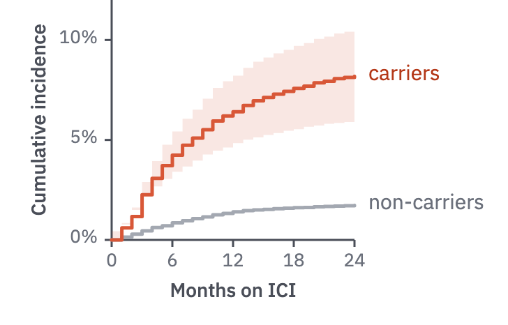
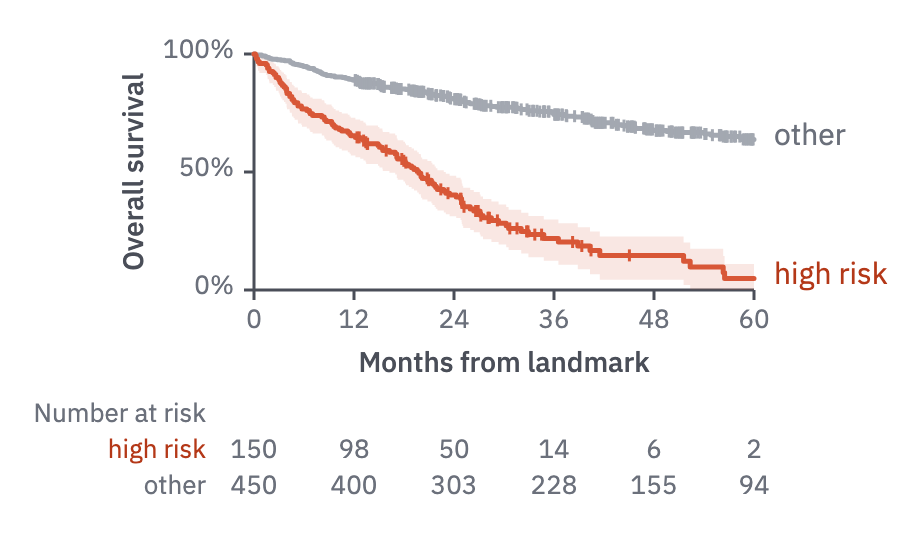
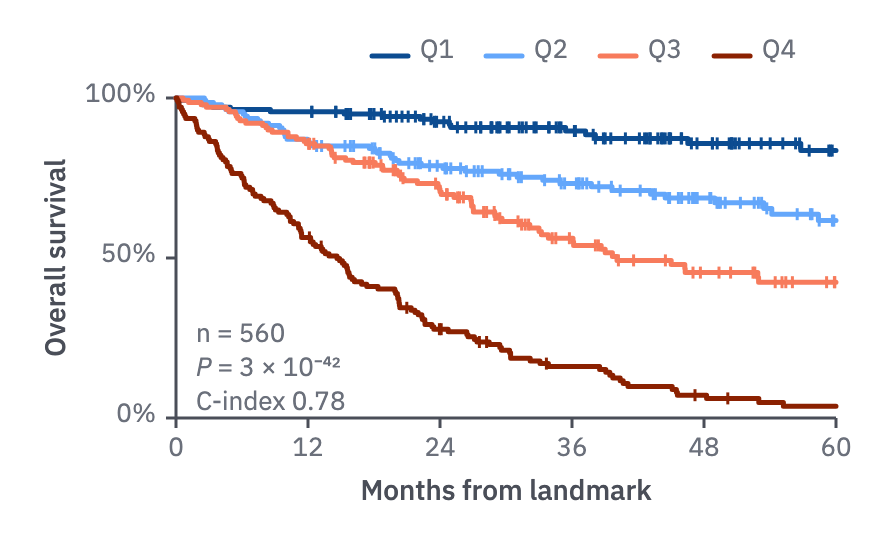

# 03 · Survival curves

For time to an event: cumulative incidence, or Kaplan–Meier survival.

- Step curves, with a step-shaped CI ribbon (14 %) for the focus series.
- Focus group in the finding's colour, comparator in `context`. Labels go just past
  the line ends, so leave about 70 px to the right of the plot.
- The x-axis is time with its unit ("Months on ICI"). The y-axis is a percentage from 0.
- Censored observations are short vertical ticks on the curve, in its colour.



```js figure=main w=364 h=233
const rnd = GA.rng(7);
const ch = GA.chart(ga, { x: 80, y: 0, w: 174, h: 172, xd: [0, 24], yd: [0, 0.12], xTicks: [0, 6, 12, 18, 24], yTicks: [0, 0.05, 0.1], yFmt: (v) => `${Math.round(v * 100)}%`, xTitle: "Months on ICI", yTitle: "Cumulative incidence" });
const curve = (k) => { const pts = [[0, 0]]; let y = 0; for (let m = 1; m <= 24; m++) { y += k * Math.exp(-m / 9) * (0.6 + rnd() * 0.8); pts.push([m, y]); } return pts; };
const car = curve(0.011), non = curve(0.0022);
ch.ribbon(car.map(([x, y]) => [x, y * 0.72]), car.map(([x, y]) => [x, y * 1.28]), { curve: "step", color: "var(--harm)" });
ch.line(non, { curve: "step", color: "var(--context)" });
ch.line(car, { curve: "step", color: "var(--harm)" });
ch.label("carriers", 24, car.at(-1)[1], { dx: 10, color: "var(--harm-text)" });
ch.label("non-carriers", 24, non.at(-1)[1], { dx: 10, color: "var(--muted)" });
```

## Numbers at risk

In full figures, add a numbers-at-risk row beneath the axis.

- One row per group in the `tick` role, named left of the axis in the group's text
  colour, counts under the x ticks, "Number at risk" above in `muted`.
- With delayed entry (a landmark cohort, left truncation) the counts can rise; the
  legend says so.



```js figure=numbers-at-risk w=460 h=268
const rnd = GA.rng(23);
// Kaplan–Meier estimate of exponential survival with uniform censoring:
// the step points, the censoring marks, a 95 % band and the numbers at risk
const km = (n, rate, end = 60) => {
  const obs = Array.from({ length: n }, () => {
    const t = -Math.log(1 - rnd()) / rate, c = 12 + rnd() * 70;
    return t <= Math.min(c, end) ? { t, e: 1 } : { t: Math.min(c, end), e: 0 };
  }).sort((a, b) => a.t - b.t);
  let s = 1, atRisk = n, v = 0;
  const pts = [[0, 1]], cens = [], band = [[0, 1, 1]];
  for (const o of obs) {
    if (o.e) {
      v += 1 / (atRisk * Math.max(1, atRisk - 1));
      s *= 1 - 1 / atRisk;
      pts.push([o.t, s]);
      const se = s * Math.sqrt(v);
      band.push([o.t, Math.max(0, s - 1.96 * se), Math.min(1, s + 1.96 * se)]);
    } else if (o.t < end) cens.push([o.t, s]);
    atRisk--;
  }
  pts.push([end, s]); band.push([end, ...band.at(-1).slice(1)]);
  return { pts, cens, band, risk: (t) => obs.filter((o) => o.t >= t).length };
};
const ch = GA.chart(ga, { x: 127, y: 27, w: 250, h: 118, xd: [0, 60], yd: [0, 1], xTicks: [0, 12, 24, 36, 48, 60], yTicks: [0, 0.5, 1], yFmt: (v) => `${Math.round(v * 100)}%`, xTitle: "Months from landmark", yTitle: "Overall survival" });
const hi = km(150, 0.04), lo = km(450, 0.008);
ch.ribbon(hi.band.map(([x, l]) => [x, l]), hi.band.map(([x, , u]) => [x, u]), { curve: "step", color: "var(--harm)" });
ch.line(lo.pts, { curve: "step", color: "var(--context)" });
ch.line(hi.pts, { curve: "step", color: "var(--harm)" });
ch.censor(lo.cens, { color: "var(--context)" });
ch.censor(hi.cens, { color: "var(--harm)" });
ch.label("high risk", 60, hi.pts.at(-1)[1], { dx: 10, color: "var(--harm-text)" });
ch.label("other", 60, lo.pts.at(-1)[1], { dx: 10, color: "var(--muted)" });
const times = [0, 12, 24, 36, 48, 60];
ch.atRisk([
  { label: "high risk", counts: times.map(hi.risk), color: "var(--harm-text)" },
  { label: "other", counts: times.map(lo.risk), color: "var(--muted)" },
], times, { y: ch.y1 + 74 });
```

## Risk groups

Risk groups (quartiles of a score) are ordered and carry valence.

- Benefit 700 and 400, harm 400 and 700, with Q1 the lowest risk.
- The curves cross, so a line key above the plot, in group order, replaces end
  labels.
- The statistics sit in the plot's empty corner in the `cap` role, one per line:
  n, the log-rank *P*, and the C-index.



```js figure=risk-groups w=442 h=270
const rnd = GA.rng(29);
// Kaplan–Meier steps and censoring marks for exponential survival
const km = (n, rate, end = 60) => {
  const obs = Array.from({ length: n }, () => {
    const t = -Math.log(1 - rnd()) / rate, c = 12 + rnd() * 70;
    return t <= Math.min(c, end) ? { t, e: 1 } : { t: Math.min(c, end), e: 0 };
  }).sort((a, b) => a.t - b.t);
  let s = 1, atRisk = n;
  const pts = [[0, 1]], cens = [];
  for (const o of obs) {
    if (o.e) { s *= 1 - 1 / atRisk; pts.push([o.t, s]); } else if (o.t < end) cens.push([o.t, s]);
    atRisk--;
  }
  pts.push([end, s]);
  return { pts, cens };
};
const ch = GA.chart(ga, { x: 88, y: 49, w: 330, h: 160, xd: [0, 60], yd: [0, 1], xTicks: [0, 12, 24, 36, 48, 60], yTicks: [0, 0.5, 1], yFmt: (v) => `${Math.round(v * 100)}%`, xTitle: "Months from landmark", yTitle: "Overall survival" });
const groups = [
  { label: "Q1", rate: 0.004, color: tok("blue-700") },
  { label: "Q2", rate: 0.009, color: tok("blue-400") },
  { label: "Q3", rate: 0.015, color: tok("vermilion-400") },
  { label: "Q4", rate: 0.05, color: tok("vermilion-700") },
];
for (const g of groups) {
  const k = km(140, g.rate);
  ch.line(k.pts, { curve: "step", color: g.color });
  ch.censor(k.cens, { color: g.color });
}
// the key above the plot, in group order
let kx = 186;
for (const g of groups) {
  ga.raw(`<path d="M${kx} 28h18" stroke="${g.color}" stroke-width="2.5" stroke-linecap="round"/>`);
  kx = ga.text(g.label, { x: kx + 24, y: 19, role: "tick" }).r + 16;
}
["n = 560", "*P* = 3 × 10⁻⁴²", "C-index 0.78"].forEach((s, i) => ga.text(s, { x: ch.x0 + 10, y: ch.sy(0.3) + i * 17, role: "cap", size: 13 }));
```
