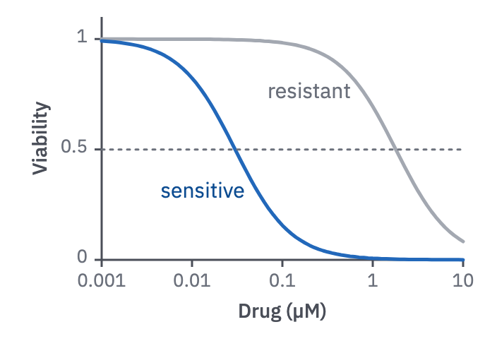

# 04 · Dose–response

For a response measured across doses, usually viability against drug concentration.

- Log₁₀ dose on x, with ticks at decades (0.001 … 10). Viability or response is on y,
  from 0 to 1.
- Show the fitted curve; add points when the individual measurements are the story.
  A dotted line at 0.5 marks the IC₅₀.
- Sensitive against resistant is valence: `benefit` against `context`. Labels go in
  the empty region beside each curve.



```js figure=main w=352 h=245
const ch = GA.chart(ga, { x: 72, y: 12, w: 256, h: 172, xd: [0.001, 10], xlog: true, yd: [0, 1.1], xTicks: [0.001, 0.01, 0.1, 1, 10], yTicks: [0, 0.5, 1], xTitle: "Drug (µM)", yTitle: "Viability" });
const hill = (ic, n = 1.4) => (x) => 1 / (1 + (x / ic) ** n);
ch.fn(hill(1.8), { color: "var(--context)" });
ch.fn(hill(0.03), { color: "var(--benefit)" });
ch.ref("y", 0.5);
ch.label("resistant", 0.82, 0.75, { anchor: "end", dx: -10, color: "var(--muted)" });
ch.label("sensitive", 0.055, 0.3, { anchor: "end", dx: -10, color: "var(--benefit-text)" });
```
