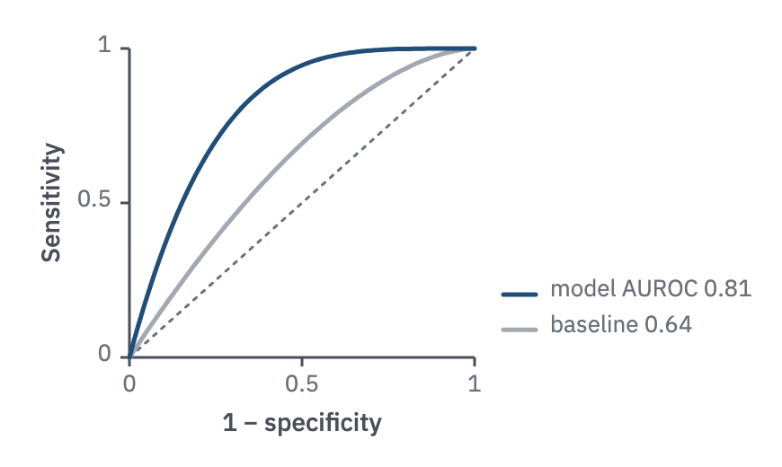

# 05 · ROC curve

For a classifier's performance against a baseline, across every threshold.

- A square plot, with a dotted chance diagonal.
- Model in `prussian`, baseline or comparator in `context`. ROC curves converge at the
  corners, so use a line key in the lower-right triangle, with the metric printed:
  "model AUROC 0.81".
- Report AUROC to 2–3 significant digits, as the paper does.
- If positives are under about 10 %, show a PR curve as well or instead.



```js figure=main w=435 h=260
const ch = GA.chart(ga, { x: 72, y: 27, w: 192, h: 172, xd: [0, 1], yd: [0, 1], xTicks: [0, 0.5, 1], yTicks: [0, 0.5, 1], xTitle: "1 − specificity", yTitle: "Sensitivity" });
ch.ref("diag");
const roc = (a) => (x) => 1 - (1 - x) ** a;
ch.fn(roc(1.7), { color: "var(--context)" });
ch.fn(roc(4.2), { color: "var(--prussian)" });
ch.lineKey([{ label: "model  AUROC 0.81", color: "var(--prussian)" }, { label: "baseline  0.64", color: "var(--context)" }], { x: ch.x1 + 16, y: ch.y1 - 44 });
```
