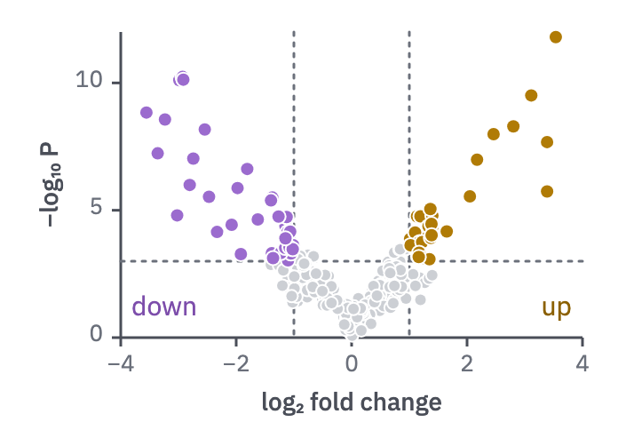

# 06 · Volcano

For many tests at once, each test's effect against its significance.

- Effect (log₂ FC) on x, symmetric about 0, and −log₁₀ *P* on y.
- Dotted threshold lines. Hits are coloured by **direction** (violet down, ochre up);
  non-hits are `context` at 55 % opacity, drawn first.
- Label up to 5 named hits, with leader lines if needed. The corner labels
  "down" and "up" go at the bottom corners, which stay empty.



```js figure=main w=348 h=251
const rnd = GA.rng(7);
const ch = GA.chart(ga, { x: 68, y: 18, w: 260, h: 172, xd: [-4, 4], yd: [0, 12], xTicks: [-4, -2, 0, 2, 4], yTicks: [0, 5, 10], xTitle: "log₂ fold change", yTitle: "−log₁₀ P" });
const pts = [];
for (let i = 0; i < 260; i++) {
  const fc = (rnd() - 0.5) * 2 * (rnd() < 0.85 ? 1.4 : 3.8), p = Math.abs(fc) * (1.2 + rnd() * 2.2) + rnd() * 1.2;
  const sig = p > 3 && Math.abs(fc) > 1;
  pts.push([fc, Math.min(p, 11.8), sig ? (fc > 0 ? "var(--ochre-500)" : "var(--violet-500)") : "var(--context)"]);
}
ch.ref("y", 3); ch.ref("x", -1); ch.ref("x", 1);
ch.dots(pts.filter((p) => p[2] === "var(--context)"), { r: 3, opacity: 0.55 });
ch.dots(pts.filter((p) => p[2] !== "var(--context)"), { r: 3.5 });
ch.label("down", -4, 0, { dx: 6, dy: -24, color: "var(--violet-600)" });
ch.label("up", 4, 0, { anchor: "end", dx: -6, dy: -24, color: "var(--ochre-600)" });
```
