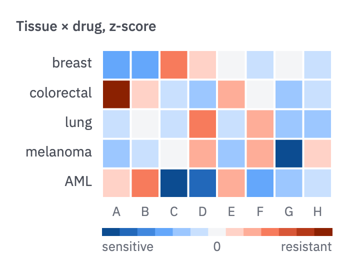
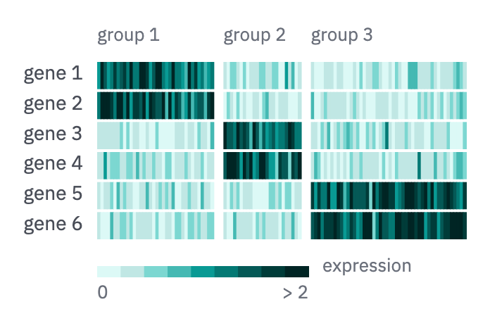
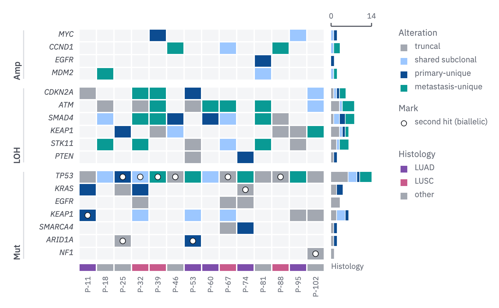

# 07 · Heatmap

For a matrix of values, such as a z-score per tissue and drug, or expression per
gene and cell.

- Diverging values use the valence scale (sensitive = blue, resistant = vermilion)
  or the direction scale, with the midpoint (`wash`) at the value that means no
  change. Magnitude uses a sequential scale from 0.
- Order rows and columns by clustering or by a known variable.
- Cells are separated by a 2 px paper gap. In dense matrices (hundreds of columns),
  keep the gaps between rows and between groups and let columns touch.
- Unmeasured cells stay blank (paper), and the caption says so.
- The key sits beneath the grid, with labelled ends and midpoint. When the scale is
  capped (`../../color.md`, *Magnitude*), the key's end reads "> 2". Put numbers in the
  cells when the matrix is 5 × 5 or smaller.



```js figure=main w=349 h=272
const rnd = GA.rng(7);
const rows = ["breast", "colorectal", "lung", "melanoma", "AML"], cols = ["A", "B", "C", "D", "E", "F", "G", "H"];
const m = rows.map(() => cols.map(() => (rnd() - 0.5) * 2.4));
m[4][2] = -2.6; m[4][3] = -2.1; m[3][6] = -2.3; m[1][0] = 2.4;
const div = [...ramp("blue", [700, 600, 500, 400, 300, 200]), tok("wash"), ...ramp("vermilion", [200, 300, 400, 500, 600, 700])];
const ch = GA.chart(ga, { x: 102, y: 50, w: 230, h: 148, axes: "", yTitle: "Tissue × drug, z-score", yTitleX: 16 });
ch.heat(m, div, { domain: [-2.5, 2.5], rowLabels: rows, colLabels: cols });
ch.key(div, { x: 102, y: 228, w: 230, lo: "sensitive", mid: "0", hi: "resistant" });
```

## Grouped columns

When columns carry an annotation (cell type, cohort), group them.

- A gap between groups sized to the matrix (6–10 px), the group's name and n above
  it.
- Rows are ordered by the group where each peaks.



```js figure=grouped-columns w=348 h=233
const rnd = GA.rng(11);
const normal = (mu = 0, sd = 1) => mu + sd * Math.sqrt(-2 * Math.log(1 - rnd())) * Math.cos(2 * Math.PI * rnd());
const groups = [{ label: "group 1", n: 36 }, { label: "group 2", n: 24 }, { label: "group 3", n: 48 }];
const genes = ["gene 1", "gene 2", "gene 3", "gene 4", "gene 5", "gene 6"];
const m = genes.map((_, i) => {
  const peak = Math.floor(i / 2), row = [];
  groups.forEach((g, k) => { for (let j = 0; j < g.n; j++) row.push(k === peak ? Math.max(0, normal(1.6, 0.45)) + (rnd() < 0.03 ? 4 : 0) : Math.abs(normal(0, 0.35))); });
  return row;
});
const q = ramp("teal", [100, 200, 300, 400, 500, 600, 700, 800, 900]);
const ch = GA.chart(ga, { x: 69, y: 43, w: 262, h: 128, axes: "" });
ch.heat(m, q, { domain: [0, 2], groups, dense: true, rowLabels: genes });
ch.key(q, { x: 69, y: 189, w: 150, lo: "0", hi: "> 2" });
ga.text("expression", { x: 229, y: 183, role: "tick" });
```

## Categorical cells

When each cell holds a class rather than a value (alterations per gene and patient,
and when each arose), the heatmap becomes an oncoprint.

- Every cell is a `wash` square, as in form 19, so an unaltered cell reads as
  tested and wild type; an untested one has no square.
- An altered cell is filled by its class. For clonal timing, use the clone tree's
  location classes (24): truncal `context`, shared subclonal `blue-300`,
  primary-unique `blue-700`, metastasis-unique `teal-500`.
- A second event in the same gene (a biallelic hit) is a small ring inside the
  cell: paper fill, 1 px `ink` edge (*Glyphs*).
- Row groups (amplification, LOH, mutation) part with a gap (about 10 px) and are named
  as in form 19; gene names are italic and sort by frequency within a group.
- Each row's classes stack into a bar at its right on a count axis, as form 18's
  totals do; annotation strips (histology, treatment) run under the grid, named
  at the right.



```js figure=categorical-cells w=740 h=457
const rnd = GA.rng(5);
// location classes, shared with the clone tree (24)
const classColors = { truncal: tok("context"), shared: tok("blue-300"), primary: tok("blue-700"), met: tok("teal-500") };
const classes = Object.keys(classColors);
const pick = (w) => { let r = rnd() * w.reduce((a, b) => a + b, 0); for (let i = 0; i < w.length; i++) if ((r -= w[i]) < 0) return classes[i]; return classes[0]; };
const genes = { Amp: ["MYC", "CCND1", "EGFR", "MDM2"], LOH: ["CDKN2A", "ATM", "SMAD4", "KEAP1", "STK11", "PTEN"], Mut: ["TP53", "KRAS", "EGFR", "KEAP1", "SMARCA4", "ARID1A", "NF1"] };
const rate = { Amp: 0.2, LOH: 0.45, Mut: 0.3 }, np = 14;
const rows = [], labels = [];
for (const [g, list] of Object.entries(genes)) list.forEach((gene, i) => {
  labels.push(gene);
  const p = gene === "TP53" ? 0.8 : rate[g] * (1 - i * 0.08);
  rows.push(Array.from({ length: np }, () => rnd() < p ? { cls: pick(g === "Mut" ? [5, 1, 1, 1.5] : [2, 1.5, 1, 2.5]), mark: g === "Mut" && rnd() < 0.35 } : null));
});
const histo = [tok("violet-600"), tok("rose-500"), tok("context")];
const ch = GA.chart(ga, { x: 117, y: 43, w: np * 26, h: 17 * 19 + 20, axes: "" });
ch.oncoprint(rows, {
  classColors, classes, rowLabels: labels, totals: true, totalW: 60, totalMax: np,
  groups: [{ label: "Amp", n: 4 }, { label: "LOH", n: 6 }, { label: "Mut", n: 7 }], groupX: 25,
  annot: [{ label: "Histology", colors: Array.from({ length: np }, () => histo[Math.floor(rnd() * 3)]) }],
  colLabels: Array.from({ length: np }, (_, j) => `P-${String(11 + j * 7).padStart(2, "0")}`),
});
const kx = ch.x1 + 110;
const ky = GA.glyphKey(ga, [
  { kind: "square", fill: classColors.truncal, label: "truncal" },
  { kind: "square", fill: classColors.shared, label: "shared subclonal" },
  { kind: "square", fill: classColors.primary, label: "primary-unique" },
  { kind: "square", fill: classColors.met, label: "metastasis-unique" },
], { x: kx, y: 43, title: "Alteration" });
GA.glyphKey(ga, [{ kind: "circle", size: 8, fill: "var(--paper)", ring: "var(--ink)", ringW: 1, label: "second hit (biallelic)" }], { x: kx, y: ky + 12, title: "Mark" });
GA.glyphKey(ga, [{ kind: "square", fill: histo[0], label: "LUAD" }, { kind: "square", fill: histo[1], label: "LUSC" }, { kind: "square", fill: histo[2], label: "other" }], { x: kx, y: ky + 80, title: "Histology" });
```
