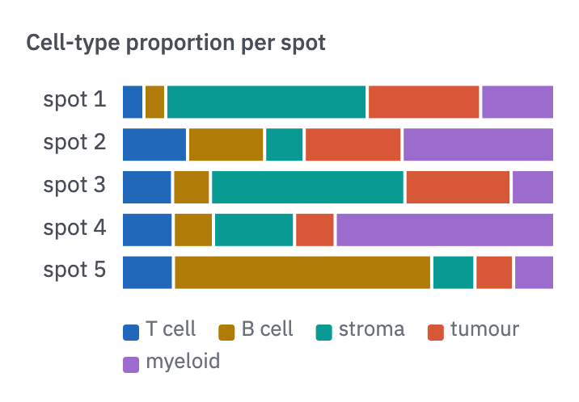
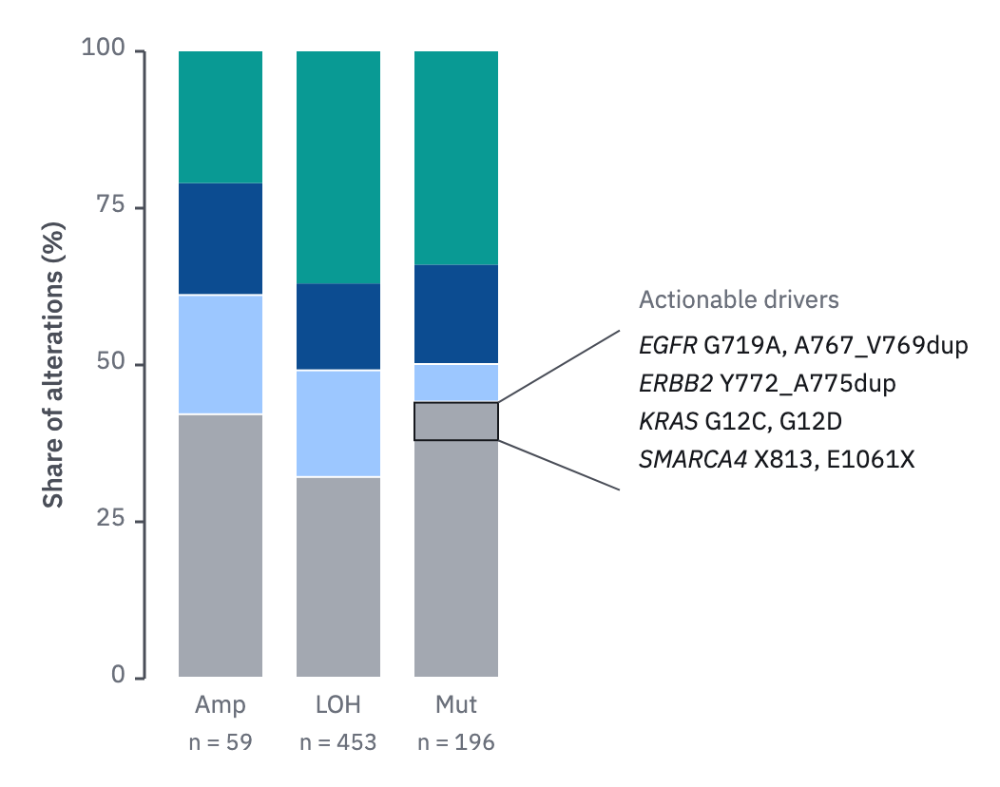

# 08 · Composition bars

For the parts of a whole across a few units, one 100 % bar each.

- Horizontal bars, with categorical slots in fixed order and the same order in every
  bar. Consider the top 5 parts and fold the rest into "other" (`context`); the
  right number depends on the data. Ordered parts (stages)
  take the ordinal steps of one ramp.
- Shares go inside segments when they fit with padding. The legend sits above or
  below the bars, in stack order.
- Sort units by the part the story is about.
- For spatial composition (e.g. deconvolved spots), use proportion dials on the
  tissue with the same colours.
- When the question is whether a part changed, add a points-and-mean panel per part
  (form 10) beside the stack.



```js figure=main w=358 h=249
const rnd = GA.rng(7);
const cats = [1, 2, 3, 4, 5].map((i) => tok(`cat-${i}`));
const ch = GA.chart(ga, { x: 76, y: 50, w: 266, h: 132, axes: "", yTitle: "Cell-type proportion per spot", yTitleX: 16 });
ch.stack([1, 2, 3, 4, 5].map((i) => ({ label: `spot ${i}`, parts: [0, 1, 2, 3, 4].map(() => 0.2 + rnd() ** 2 * 1.8) })), cats);
// the legend beneath, in stack order, wrapping to the plot's width
const names = ["T cell", "B cell", "stroma", "tumour", "myeloid"];
let lx = 76, ly = 198;
names.forEach((n, i) => {
  if (lx + 14 + n.length * 7.5 > 342) { lx = 76; ly += 20; }
  ga.raw(`<rect x="${lx}" y="${ly + 3}" width="10" height="10" rx="2" fill="${cats[i]}"/>`);
  lx = ga.text(n, { x: lx + 14, y: ly, role: "tick" }).r + 14;
});
```

## A named part

To say what one part of a bar or column holds (the actionable drivers among the
truncal mutations), zoom into it as form 20's atlas does.

- Frame the part 1 px `ink` and run two straight 1 px `ink-2` leaders from its
  corners to a short list beside the bar.
- The list's title is `muted`; its items are `ink`, gene names italic.



```js figure=a-named-part w=526 h=414
const classColors = [tok("context"), tok("blue-300"), tok("blue-700"), tok("teal-500")];
const shares = { Amp: [42, 19, 18, 21], LOH: [32, 17, 14, 37], Mut: [44, 6, 16, 34] }, n = { Amp: 59, LOH: 453, Mut: 196 };
const ch = GA.chart(ga, { x: 76, y: 27, w: 190, h: 330, xd: [0, 3], yd: [0, 100], yTicks: [0, 25, 50, 75, 100], yTitle: "Share of alterations (%)", axes: "y" });
let s = "";
Object.entries(shares).forEach(([g, parts], j) => {
  const cx = ch.x0 + 18 + j * 62, w = 44;
  let acc = 0;
  parts.forEach((p, k) => { s += `<rect x="${cx}" y="${ch.sy(acc + p)}" width="${w}" height="${ch.sy(acc) - ch.sy(acc + p) - (acc + p < 100 ? 1 : 0)}" fill="${classColors[k]}"/>`; acc += p; });
  ga.text(g, { x: cx + w / 2, y: ch.y1 + 8, role: "tick", anchor: "middle" });
  ga.text(`n = ${n[g]}`, { x: cx + w / 2, y: ch.y1 + 28, role: "tick", size: 12, anchor: "middle", color: "var(--muted)" });
});
ga.raw(s);
// the actionable drivers inside the truncal part of the mutation column
const segX = ch.x0 + 18 + 2 * 62, seg = { x0: segX, x1: segX + 44, y0: ch.sy(44), y1: ch.sy(38) };
const lines = ["*EGFR* G719A, A767_V769dup", "*ERBB2* Y772_A775dup", "*KRAS* G12C, G12D", "*SMARCA4* X813, E1061X"];
const tb = { x0: ch.x1 + 70, y0: seg.y0 - 44 };
let yy = tb.y0 + 8;
ga.text("Actionable drivers", { x: tb.x0, y: tb.y0 - 16, role: "tick", color: "var(--muted)" });
for (const l of lines) { ga.text(l, { x: tb.x0, y: yy, role: "tick", size: 13, color: "var(--ink)" }); yy += 20; }
// the part is framed, and two straight leaders zoom it into its list
ga.raw(`<rect x="${seg.x0}" y="${seg.y0}" width="${seg.x1 - seg.x0}" height="${seg.y1 - seg.y0}" fill="none" stroke="var(--ink)" stroke-width="1"/>`);
GA.leaders(ga, seg, { x0: tb.x0 - 10, x1: tb.x0 + 200, y0: tb.y0 + 6, y1: yy + 2 });
```
