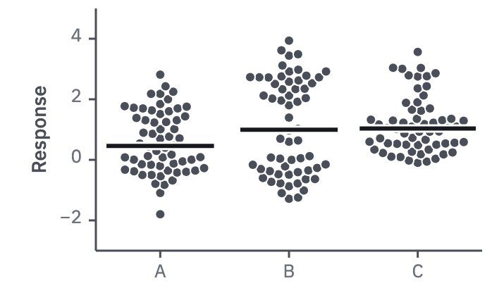

# 09 · Beeswarm

For comparing groups of observations: it shows the shape, the n and the outliers
along with the centre.

- Every observation is a point, placed without overlap around the group's centre
  (a beeswarm, or a quasirandom layout when n is large).
- The median (or mean, if the paper reports means) is a summary bar across the swarm;
  add its 95 % CI as a 2 px line when the comparison needs it.
- Point radius 4.5 up to about 50 per group, 3–3.5 for about 100. For several hundred
  per group and one mode, a box with the points behind it in `context` at 40 % keeps
  the width in check.
- Group names are the x tick labels; the points are `ink-2`. Colour carries a second
  factor when there is one.
- For n below about 30, this is also the form for a distribution: the points say
  more than any histogram or violin of the same data.



```js figure=main w=349 h=218
const rnd = GA.rng(11);
const normal = (mu = 0, sd = 1) => mu + sd * Math.sqrt(-2 * Math.log(1 - rnd())) * Math.cos(2 * Math.PI * rnd());
const A = Array.from({ length: 60 }, () => normal(0.8, 1));
const B = Array.from({ length: 60 }, (_, i) => (i % 2 ? normal(2.6, 0.6) : normal(-0.4, 0.6)));
const C = Array.from({ length: 60 }, () => Math.min(4.6, -0.6 + Math.exp(normal(0.4, 0.6))));
const ch = GA.chart(ga, { x: 68, y: 6, w: 274, h: 172, xd: [0.5, 3.5], yd: [-3, 5], xTicks: [1, 2, 3], xFmt: (v) => "ABC"[v - 1], yTicks: [-2, 0, 2, 4], yTitle: "Response" });
ch.swarm([{ x: 1, values: A }, { x: 2, values: B }, { x: 3, values: C }], { r: 3 });
```
