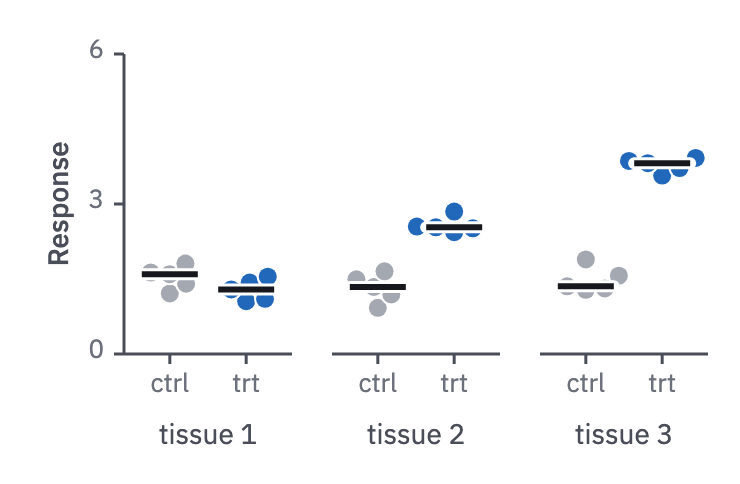

# 10 · Small multiples

For factorial experiments and for any comparison repeated across levels.

- One panel per level of the factors the comparison is not about, laid out as a grid
  (rows for one factor, columns for another). The tested factor goes on x in every
  panel, with the points and a summary (form 09).
- Row and column names are `label` text beside and above the grid.
- Panels share the y scale, so heights compare across the grid. When levels differ
  by orders of magnitude, give each panel its own scale and say so in the caption.
- Label the y-axis once, on the first panel, and the x title once, on the last;
  each is centred on its own panel's axis.



```js figure=main w=370 h=242
const rnd = GA.rng(13);
const normal = (mu = 0, sd = 1) => mu + sd * Math.sqrt(-2 * Math.log(1 - rnd())) * Math.cos(2 * Math.PI * rnd());
const PW = 84, PG = 20, X0 = 62, Y = 27, PH = 150;
[[1.5, 1.4], [1.4, 2.6], [1.3, 3.7]].forEach(([mc, mt], k) => {
  const ch = GA.chart(ga, { x: X0 + k * (PW + PG), y: Y, w: PW, h: PH, xd: [0.4, 2.6], yd: [0, 6], xTicks: [1, 2], xFmt: (v) => (v === 1 ? "ctrl" : "trt"), yTicks: k ? undefined : [0, 3, 6], axes: k ? "x" : "xy", yTitle: k ? undefined : "Response" });
  const ctrl = Array.from({ length: 5 }, () => normal(mc, 0.35)), trt = Array.from({ length: 5 }, () => normal(mt, 0.35));
  ch.swarm([{ x: 1, values: ctrl, color: "var(--context)" }, { x: 2, values: trt, color: "var(--cat-1)" }], { hw: 14 });
  ga.text(`tissue ${k + 1}`, { x: X0 + k * (PW + PG) + PW / 2, y: Y + PH + 34, role: "label", size: 14, anchor: "middle" });
});
```
