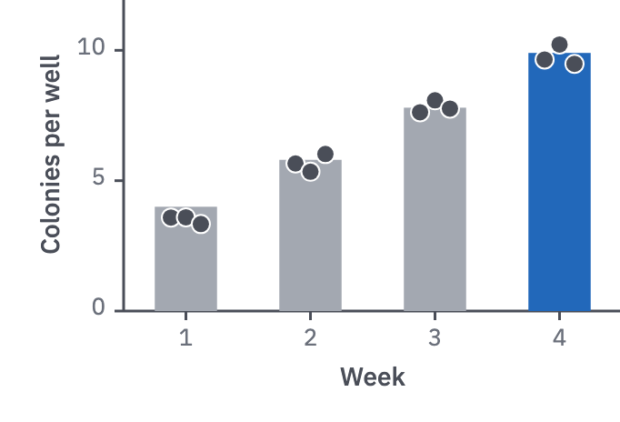
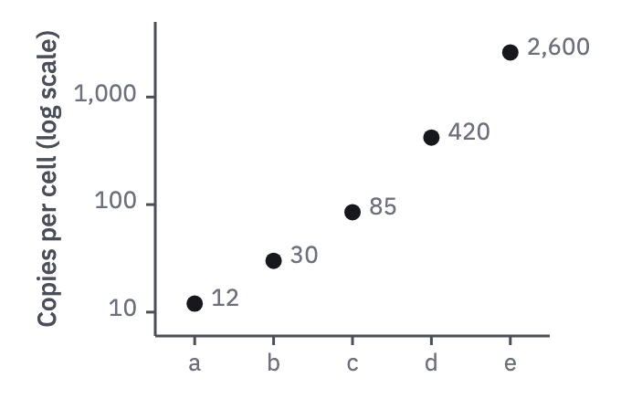

# 11 · Amounts

For a few amounts that the reader compares by size: counts, concentrations, yields.

- **Bars from zero:** vertical bars, about half the band wide, from a zero baseline.
  With n ≤ 10 per bar, the replicates sit on the bar as points. One accent bar for the
  finding, the rest `context`.
- Time points or doses run left to right; for a response over time, a line through
  the means with the replicates as points reads as well as bars.



```js figure=main w=341 h=232
const rnd = GA.rng(11);
const normal = (mu = 0, sd = 1) => mu + sd * Math.sqrt(-2 * Math.log(1 - rnd())) * Math.cos(2 * Math.PI * rnd());
const ch = GA.chart(ga, { x: 68, y: -1, w: 274, h: 172, xd: [0.5, 4.5], yd: [0, 12], xTicks: [1, 2, 3, 4], yTicks: [0, 5, 10], xTitle: "Week", yTitle: "Colonies per well" });
const means = [4, 5.8, 7.8, 9.9];
ch.vbars(means.map((v, i) => ({ x: i + 1, v, color: i === 3 ? "var(--cat-1)" : "var(--context)" })));
ch.dots(means.flatMap((v, i) => [-0.12, 0, 0.12].map((d) => [i + 1 + d, v + normal(0, 0.35), "var(--ink-2)"])));
```

## Dots on a log axis

When the amounts span orders of magnitude, a log axis has no zero for a bar to start
from.

- One `ink` dot per category, with its value beside it.
- Log ticks at decades (10, 100, 1,000).



```js figure=dots-on-a-log-axis w=340 h=224
const vals = [12, 30, 85, 420, 2600];
const ch = GA.chart(ga, { x: 85, y: 12, w: 216, h: 172, xd: [0.5, 5.5], yd: [6, 5000], ylog: true, xTicks: [1, 2, 3, 4, 5], xFmt: (v) => "abcde"[v - 1], yTicks: [10, 100, 1000], yFmt: (v) => v.toLocaleString("en"), yTitle: "Copies per cell (log scale)" });
ch.dots(vals.map((v, i) => [i + 1, v]));
vals.forEach((v, i) => ch.label(v.toLocaleString("en"), i + 1, v, { dx: 9, dy: -9, role: "tick" }));
```
