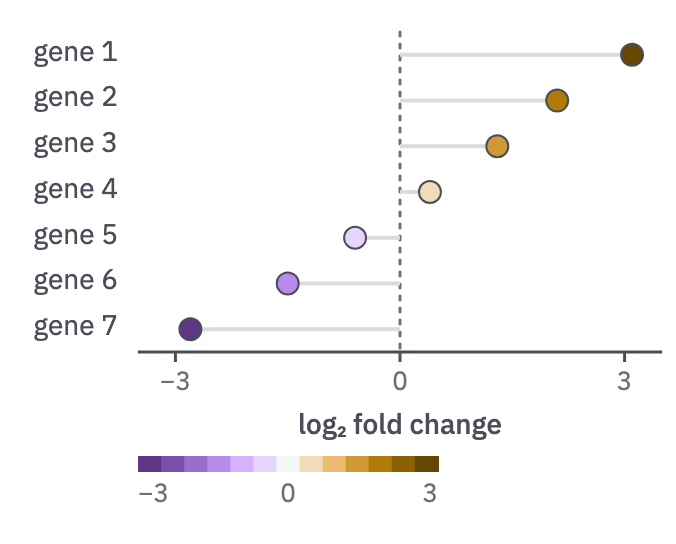

# 12 · Lollipop

For ranked values that also carry a colour scale, or signed values about a reference.

- One row per item, sorted by value. A 2 px `rule` stem runs from the reference
  (0, or the null) to a dot at the value.
- The dot takes the scale colour with a 1 px `ink-2` ring, so light steps stay
  visible: the quantity ramp for one-sided values, the direction ramp centred on 0
  for signed values.
- Row labels left of the plot in `ink-2`; a dotted reference line at the stem origin.
- Show the colour key beneath, with labelled ends and midpoint.



```js figure=main w=338 h=272
const dir = [...ramp("violet", [700, 600, 500, 400, 300, 200]), tok("wash"), ...ramp("ochre", [200, 300, 400, 500, 600, 700])];
const pick = (v) => dir[Math.max(0, Math.min(dir.length - 1, Math.round(((v + 3) / 6) * (dir.length - 1))))];
const vals = [3.1, 2.1, 1.3, 0.4, -0.6, -1.5, -2.8];
const ch = GA.chart(ga, { x: 69, y: 16, w: 262, h: 160, xd: [-3.5, 3.5], xTicks: [-3, 0, 3], axes: "x", xTitle: "log₂ fold change" });
ch.ref("x", 0);
ch.lollipop(vals.map((v, i) => ({ label: `gene ${i + 1}`, v, color: pick(v) })));
ch.key(dir, { x: 69, y: 228, w: 150, lo: "−3", mid: "0", hi: "3" });
```
