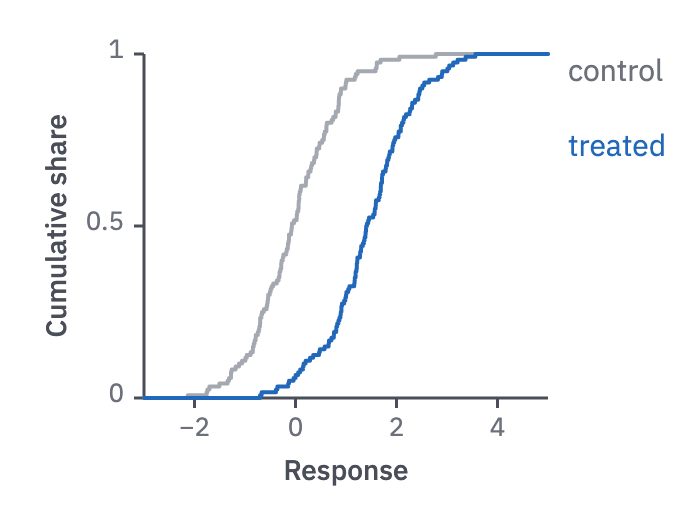

# 13 · ECDF

For a distribution without bins, or two distributions compared.

- A step curve rising from 0 to 1: each step is one observation, so the curve is
  stable at any n and needs no bin width.
- Focus group in the finding's colour, comparator in `context`, labelled at the right
  end. For n ≤ 20, mark each observation with a dot on its step.
- The y-axis is "Cumulative share" from 0 to 1; the x-axis is the measured value.
- When a histogram suits the audience better (large n), state the bin width and check
  that the shape holds at two other widths.



```js figure=main w=350 h=260
const rnd = GA.rng(17);
const normal = (mu = 0, sd = 1) => mu + sd * Math.sqrt(-2 * Math.log(1 - rnd())) * Math.cos(2 * Math.PI * rnd());
const ecdf = (xs) => { const s = [...xs].sort((a, b) => a - b), n = s.length; return [[-3, 0], ...s.map((v, i) => [v, (i + 1) / n]), [5, 1]]; };
const ctl = Array.from({ length: 120 }, () => normal(0, 0.9)), trt = Array.from({ length: 120 }, () => normal(1.4, 0.8));
const ch = GA.chart(ga, { x: 72, y: 27, w: 202, h: 172, xd: [-3, 5], yd: [0, 1], xTicks: [-2, 0, 2, 4], yTicks: [0, 0.5, 1], xTitle: "Response", yTitle: "Cumulative share" });
ch.line(ecdf(ctl), { curve: "step", color: "var(--context)", width: 2 });
ch.line(ecdf(trt), { curve: "step", color: "var(--cat-1)", width: 2 });
ch.label("control", 5, 1, { dx: 10, dy: 2, color: "var(--muted)" });
ch.label("treated", 5, 0.72, { dx: 10, color: "var(--cat-1-text)" });
```
