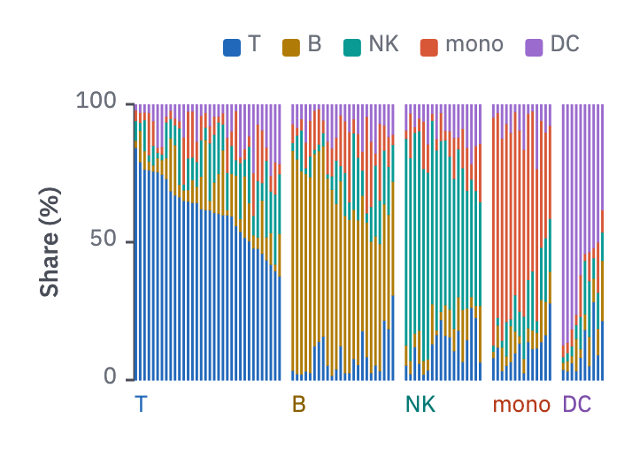

# 14 · Composition columns

For community, cell-type or ancestry composition over dozens to hundreds of samples.

- One 100 % column per sample, parts in one fixed stack order.
- Group samples by their dominant part (or by the design: control, treated), with a
  small gap between groups and the group's name beneath it in the part's text colour.
  Within a group, sort by the dominant part's share.
- As in form 08, consider the top 5 parts and fold the rest into "other" in
  `context`; the right number depends on the data, up to the seven categorical slots.
- The legend sits above or below the plot, in stack order.



```js figure=main w=357 h=254
const rnd = GA.rng(19);
const names = ["T", "B", "NK", "mono", "DC"], sizes = [34, 24, 18, 14, 10];
const cats = [1, 2, 3, 4, 5].map((i) => tok(`cat-${i}`));
const cols = [];
sizes.forEach((n, k) => {
  const g = Array.from({ length: n }, () => { const p = [0, 1, 2, 3, 4].map(() => 0.1 + rnd() ** 2); p[k] += 1 + rnd() * 3; return p; });
  g.sort((a, b) => b[k] / b.reduce((s, x) => s + x, 0) - a[k] / a.reduce((s, x) => s + x, 0));
  cols.push(...g);
});
const ch = GA.chart(ga, { x: 76, y: 59, w: 266, h: 156, yd: [0, 1], yTicks: [0, 0.5, 1], yFmt: (v) => String(v * 100), axes: "y", yTitle: "Share (%)" });
ch.columns(cols, cats, { groups: sizes.map((n, k) => ({ n, label: names[k], color: `var(--cat-${k + 1}-text)` })) });
// the legend above, in stack order
let lx = 126;
names.forEach((n, i) => {
  ga.raw(`<rect x="${lx}" y="22" width="10" height="10" rx="2" fill="${cats[i]}"/>`);
  lx = ga.text(n, { x: lx + 14, y: 19, role: "tick" }).r + 12;
});
```
