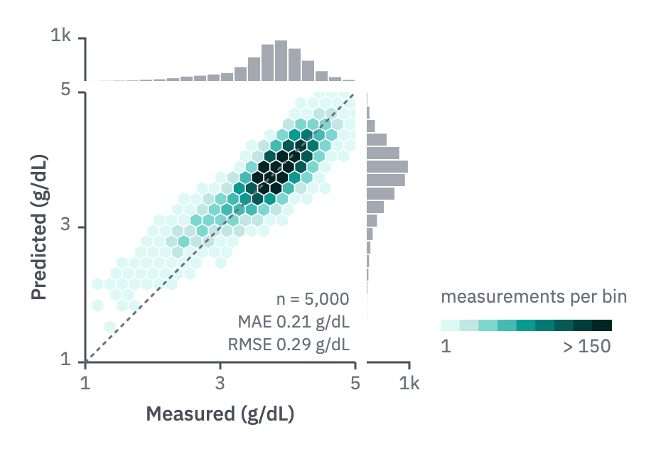
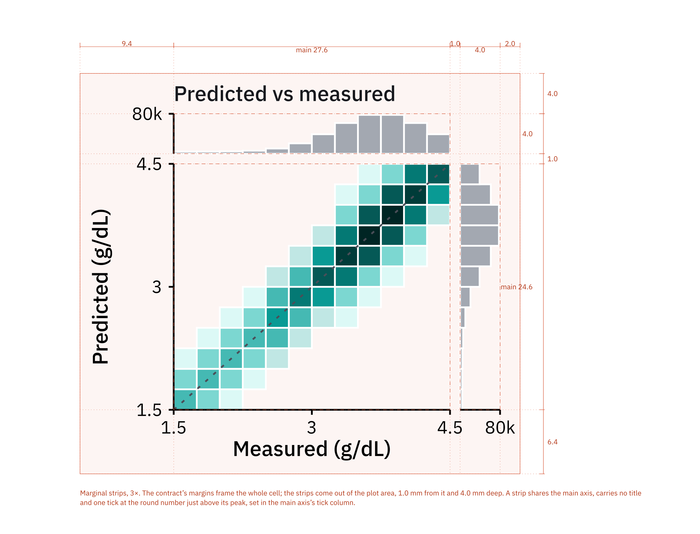

# 15 · Predicted vs observed

For a regression's predictions against the measured values, over many observations.

- A square plot with one scale on both axes and the same ticks; the measured value
  on x, the prediction on y. A dotted identity line runs corner to corner.
- Density as hexagonal bins on the quantity ramp, capped near the 95th percentile of
  the bin counts; the key sits beside the plot with "> cap" at its end. Empty bins
  stay paper. Under about 500 points, plot the points instead (r 3, `ink-2`).
- Marginal strips on the top and right show each axis's distribution, in `context`.
  They share the main axes, carry one tick at their peak and no title
  (`../../../formats/publication/README.md`, *Composite panels*).
- The metrics (n, MAE, RMSE, with units) sit in the empty corner below the identity
  line in the `cap` role.
- Small multiples of several variables keep their own scales; say so in the caption.



```js figure=main w=458 h=316
const rnd = GA.rng(23);
const normal = (mu = 0, sd = 1) => mu + sd * Math.sqrt(-2 * Math.log(1 - rnd())) * Math.cos(2 * Math.PI * rnd());
const ch = GA.chart(ga, { x: 60, y: 65, w: 190, h: 190, xd: [1, 5], yd: [1, 5], xTicks: [1, 3, 5], yTicks: [1, 3, 5], xTitle: "Measured (g/dL)", yTitle: "Predicted (g/dL)" });
const pts = Array.from({ length: 5000 }, () => {
  const x = rnd() < 0.8 ? normal(3.9, 0.35) : normal(3.0, 0.6);
  return [x, 0.75 * x + 0.95 + normal(0, 0.22)];
});
const q = ramp("teal", [100, 200, 300, 400, 500, 600, 700, 800, 900]);
ch.hexbin(pts, q, { r: 5, domain: [1, 150] });
ch.ref("diag");
ch.marginal("top", pts.map((p) => p[0]), { bins: 20, peak: true });
ch.marginal("right", pts.map((p) => p[1]), { bins: 20, peak: true });
["n = 5,000", "MAE 0.21 g/dL", "RMSE 0.29 g/dL"].forEach((s, i) => ga.text(s, { x: ch.x1 - 4, y: ch.y1 - 50 + i * 16, role: "cap", size: 12, anchor: "end" }));
ch.key(q, { x: ch.x1 + 60, y: ch.y1 - 30, w: 120, lo: "1", hi: "> 150" });
ga.text("measurements per bin", { x: ch.x1 + 60, y: ch.y1 - 52, role: "tick" });
```

Marginal strips follow the publication format's composite panel
(`../../../formats/publication/README.md`, *Composite panels*), drawn at scale in
`../../../formats/publication/specimen-marginal.typ`:


