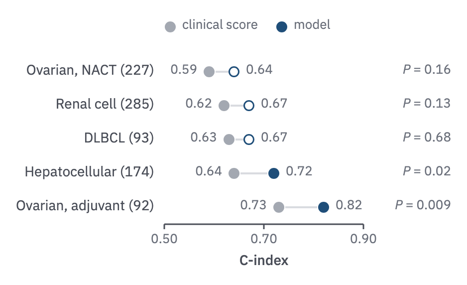
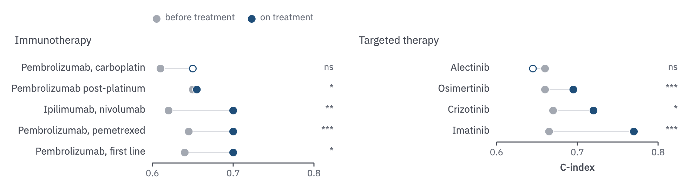

# 16 · Dumbbell

For one metric measured by two methods across cohorts or settings: a model against a
clinical score, before against after treatment.

- One row per cohort, the cohort's name (and n) left of the plot in `label`. A 2 px
  `rule` stem joins the comparator dot (`context`) to the model's dot (`prussian`).
- The model's dot is hollow when the difference is not significant, as in form 02.
- Sparse panels print both values at the outer ends in the `tick` role and the exact
  *P* in `muted`, right-aligned in one column at the plot's right edge so the column
  does not stagger with the rows.
- A key of the two dots sits above the plot. The x axis spans the data with a small
  pad, shared across small multiples, so the dots use the width; a bounded metric
  need not show its full range.



```js figure=main w=469 h=286
const ch = GA.chart(ga, { x: 165, y: 55, w: 200, h: 170, xd: [0.5, 0.9], xTicks: [0.5, 0.7, 0.9], xFmt: (v) => v.toFixed(2), xTitle: "C-index", axes: "x" });
ch.dumbbell([
  { label: "Ovarian, NACT (227)", a: 0.59, b: 0.64, p: 0.16 },
  { label: "Renal cell (285)", a: 0.62, b: 0.67, p: 0.13 },
  { label: "DLBCL (93)", a: 0.63, b: 0.67, p: 0.68 },
  { label: "Hepatocellular (174)", a: 0.64, b: 0.72, p: 0.02 },
  { label: "Ovarian, adjuvant (92)", a: 0.73, b: 0.82, p: 0.009 },
], { values: true, p: "exact", pRight: 453 });
ch.dotKey([{ label: "clinical score", color: "var(--context)" }, { label: "model", color: "var(--prussian)" }], { x: 165, y: 19 });
```

## Dense panels

Many rows, or rows across small multiples, drop the values and let the shared axis
read them.

- Stars may replace the exact *P*: one for < 0.05, two for < 0.01, three for
  < 0.001, "ns" otherwise, right-aligned in the same column; the legend defines them
  and a supplementary table gives the exact values.
- Groups of rows (therapy classes) become small multiples that keep one row pitch,
  so a short group ends early rather than spreading its rows.



```js figure=dense-panels w=981 h=273
const multiples = [
  { name: "Immunotherapy", rows: [
    { label: "Pembrolizumab, carboplatin", a: 0.61, b: 0.65, p: 0.08 },
    { label: "Pembrolizumab post-platinum", a: 0.65, b: 0.655, p: 0.03 },
    { label: "Ipilimumab, nivolumab", a: 0.62, b: 0.70, p: 0.004 },
    { label: "Pembrolizumab, pemetrexed", a: 0.645, b: 0.70, p: 0.0004 },
    { label: "Pembrolizumab, first line", a: 0.64, b: 0.70, p: 0.02 },
  ] },
  { name: "Targeted therapy", rows: [
    { label: "Alectinib", a: 0.66, b: 0.645, p: 0.4 },
    { label: "Osimertinib", a: 0.66, b: 0.695, p: 0.0006 },
    { label: "Crizotinib", a: 0.67, b: 0.72, p: 0.03 },
    { label: "Imatinib", a: 0.665, b: 0.77, p: 0.0002 },
  ] },
];
const SW = 490, pitch = 30;
multiples.forEach((g, k) => {
  const x = 21 + k * SW + 196, w = SW - 196 - 64, h = g.rows.length * pitch;
  const ch = GA.chart(ga, { x, y: 83, w, h, xd: [0.6, 0.8], xTicks: [0.6, 0.7, 0.8], xFmt: (v) => v.toFixed(1), xTitle: k === multiples.length - 1 ? "C-index" : undefined, axes: "x" });
  ga.text(g.name, { x: 21 + k * SW, y: 51, role: "label", size: 15 });
  ch.dumbbell(g.rows, { pitch, p: "stars", pRight: x + w + 28 });
  if (k === 0) ch.dotKey([{ label: "before treatment", color: "var(--context)" }, { label: "on treatment", color: "var(--prussian)" }], { x: 217, y: 19 });
});
```
