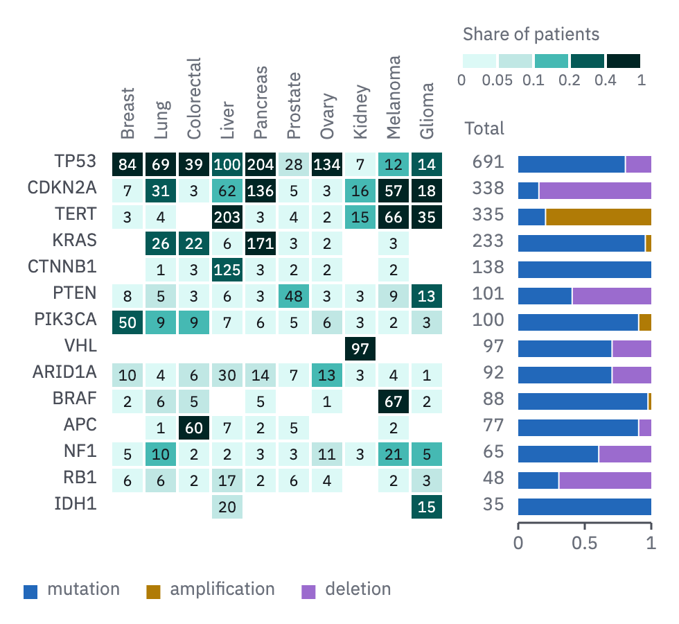

# 18 · Count matrix

For counts over two categorical axes, when the counts are the finding: patients with
a driver in each gene per tumour type, events per site per arm.

- One cell per pair, separated by a 2 px paper gap. The **count is printed in every
  filled cell** (`tick`, 11 px), ink on the light steps and paper from step 700 on.
  Zero stays blank, and the caption says so.
- The shade bins a **share** (the count over its column's n), so columns of
  different size compare: five steps of the quantity ramp (100, 200, 400, 700, 900),
  edges at round shares (0, 0.05, 0.1, 0.2, 0.4, 1). The key is the five swatches
  with the edges printed between them. It sits above the grid, in the room beside the
  upward column names, rather than add a row beneath (*Labels*).
- Rows sort by their total; columns by the story (organ, or n). Row names left of
  the grid; column names read upward above it.
- Right of the grid, one column of row totals in the `tick` role, titled once
  ("Total"), and, when it matters how each row's count splits, a 100 % bar per row
  (form 08's rules, a 0–1 axis beneath, the legend below as square swatches). The
  bar's parts keep to the categorical slots and skip teal, which the matrix already
  uses.



```js figure=main w=490 h=450
const rnd = GA.rng(41);
const X = 16, T = 1;
const types = ["Breast", "Lung", "Colorectal", "Liver", "Pancreas", "Prostate", "Ovary", "Kidney", "Melanoma", "Glioma"];
const genes = ["TP53", "CDKN2A", "KRAS", "PIK3CA", "PTEN", "ARID1A", "TERT", "APC", "BRAF", "RB1", "NF1", "CTNNB1", "VHL", "IDH1"];
const nType = [198, 86, 60, 326, 241, 286, 113, 144, 107, 41];
// propensity of each gene in each type (0 = never), to make a plausible pattern
const hot = { TP53: [.35, .8, .6, .3, .7, .1, .95, .05, .15, .3], CDKN2A: [.03, .4, .05, .15, .6, .02, .03, .1, .45, .5], KRAS: [0, .3, .45, .02, .9, .01, .02, 0, .02, 0],
  PIK3CA: [.35, .1, .15, .02, .02, .02, .05, .02, .02, .1], PTEN: [.05, .05, .05, .02, .01, .15, .03, .03, .1, .45], ARID1A: [.05, .06, .1, .12, .06, .02, .1, .02, .03, .02],
  TERT: [.02, .05, 0, .5, .01, .01, .02, .1, .7, .8], APC: [0, .02, .8, .02, .01, .02, 0, 0, .02, 0], BRAF: [.01, .06, .1, 0, .02, 0, .01, 0, .5, .05],
  RB1: [.03, .1, .02, .05, .01, .02, .04, 0, .02, .1], NF1: [.03, .1, .03, .01, .01, .01, .08, .02, .2, .1], CTNNB1: [0, .01, .05, .3, .01, .01, .02, 0, .02, 0],
  VHL: [0, 0, 0, 0, 0, 0, 0, .6, 0, 0], IDH1: [0, 0, 0, .05, 0, 0, 0, 0, 0, .3] };
const M = genes.map((g) => nType.map((n, j) => Math.round(n * hot[g][j] * (0.7 + 0.6 * rnd()))));
const totals = M.map((r) => r.reduce((a, b) => a + b, 0));
const order = genes.map((_, i) => i).sort((a, b) => totals[b] - totals[a]);
const parts = { TP53: [.8, 0, .2], CDKN2A: [.15, 0, .85], KRAS: [.95, .05, 0], PIK3CA: [.9, .1, 0], PTEN: [.4, 0, .6], ARID1A: [.7, 0, .3], TERT: [.2, .8, 0], APC: [.9, 0, .1], BRAF: [.97, .03, 0], RB1: [.3, 0, .7], NF1: [.6, 0, .4], CTNNB1: [1, 0, 0], VHL: [.7, 0, .3], IDH1: [1, 0, 0] };
const q = ramp("teal", [100, 200, 400, 700, 900]);
const ch = GA.chart(ga, { x: X + 64, y: T + 108, w: 240, h: 14 * 19, axes: "" });
const pc = [tok("cat-1"), tok("cat-2"), tok("cat-5")];
ch.counts(order.map((i) => M[i]), q, {
  bins: [0, 0.05, 0.1, 0.2, 0.4, 1], dark: 3, shade: (v, i, j) => v / nType[j],
  rowLabels: order.map((i) => genes[i]), colLabels: types,
  totals: order.map((i) => totals[i]), totalsTitle: "Total",
  parts: order.map((i) => parts[genes[i]]), partColors: pc, partW: 96,
});
// binned key: one swatch per bin, the edges between them
const kx = X + 318, ky = T + 38, kw = 26;
ga.text("Share of patients", { x: kx, y: ky - 20, role: "tick", color: "var(--muted)" });
ga.raw(q.map((col, i) => `<rect x="${kx + i * kw}" y="${ky}" width="${kw - 2}" height="10" fill="${col}"/>`).join(""));
["0", "0.05", "0.1", "0.2", "0.4", "1"].forEach((s, i) => ga.text(s, { x: kx + i * kw - 1, y: ky + 14, role: "tick", size: 11, anchor: "middle" }));
ch.dotKey([{ label: "mutation", color: pc[0] }, { label: "amplification", color: pc[1] }, { label: "deletion", color: pc[2] }], { x: X, y: ch.y1 + 44, square: true });
```

## In each format

| Element | Canvas | Print |
|---|---|---|
| Count in a cell | `tick`, 11 px | 5 pt, tabular |
