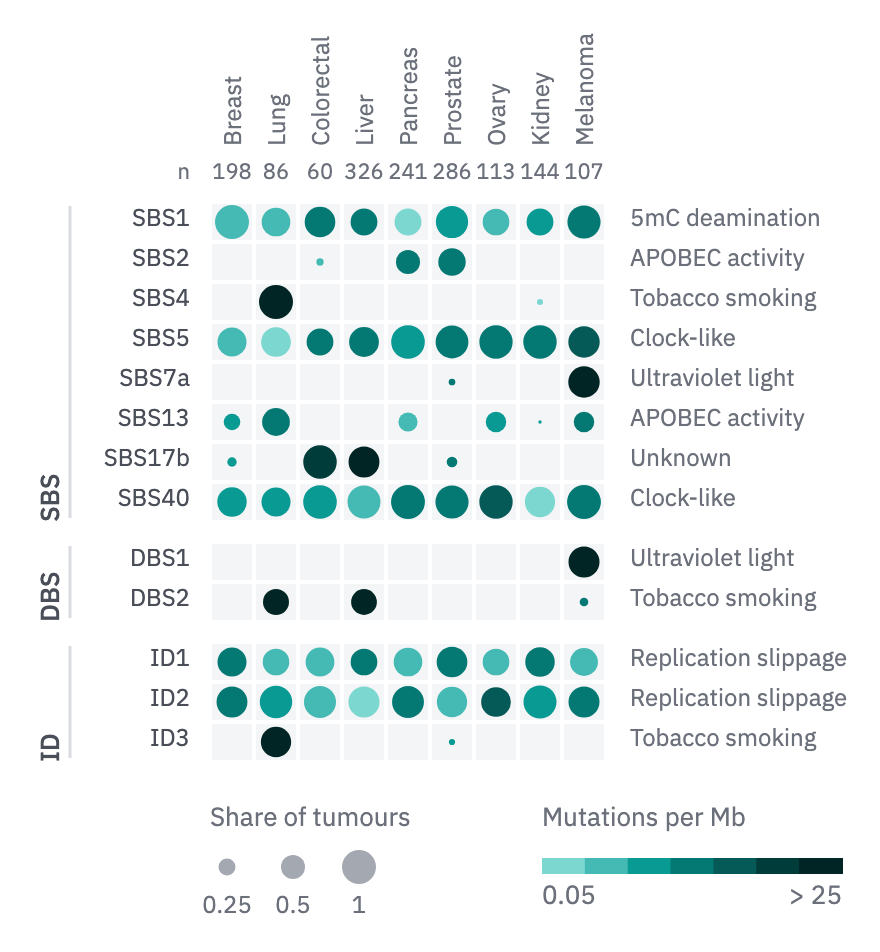

# 19 · Dot matrix

For two measures per cell of a matrix: the share of tumours with a signature and the
burden among them, the share of cells expressing a gene and its mean level.

- Every cell is a `wash` square with a 2 px paper gap, so a cell without a dot reads
  as measured and absent. A cell that was not measured has no square.
- The dot's **area** carries the share (radius ∝ √share); the largest dot fills
  the cell less 1.5 px. Its **colour** carries the magnitude on the quantity ramp
  from step 300, so the lightest dot still shows on the wash. Use a log scale when
  the magnitude spans decades, and cap it (`../../color.md`).
- Each column's n sits in a row above the grid in the `tick` role, with "n" at the
  row's left; column names read upward above that.
- Row groups (SBS, DBS, ID) part with a gap (about 10 px) and are named upward at the left
  beside a `rule` bar. A text column right of the grid (`tick`) annotates each row
  (the proposed aetiology) and stays blank where there is nothing to say.
- Two keys beneath: dots in `context` at three shares (0.25, 0.5, 1), and the colour
  key with labelled ends.



```js figure=main w=440 h=476
const rnd = GA.rng(43);
const X = 21, T = -17;
const sigs = ["SBS1", "SBS2", "SBS4", "SBS5", "SBS7a", "SBS13", "SBS17b", "SBS40", "DBS1", "DBS2", "ID1", "ID2", "ID3"];
const notes = ["5mC deamination", "APOBEC activity", "Tobacco smoking", "Clock-like", "Ultraviolet light", "APOBEC activity", "Unknown", "Clock-like", "Ultraviolet light", "Tobacco smoking", "Replication slippage", "Replication slippage", "Tobacco smoking"];
const cols = ["Breast", "Lung", "Colorectal", "Liver", "Pancreas", "Prostate", "Ovary", "Kidney", "Melanoma"], n = [198, 86, 60, 326, 241, 286, 113, 144, 107];
const where = { SBS4: [1], SBS7a: [8], DBS1: [8], DBS2: [1, 3], SBS17b: [3, 2], ID3: [1] };
const share = [], mag = [];
sigs.forEach((s) => {
  share.push(cols.map((_, j) => {
    if (where[s]) return where[s].includes(j) ? 0.5 + 0.5 * rnd() : rnd() < 0.15 ? 0.1 * rnd() : 0;
    if (["SBS1", "SBS5", "SBS40", "ID1", "ID2"].includes(s)) return 0.6 + 0.4 * rnd();
    return rnd() < 0.6 ? rnd() * 0.8 : 0;
  }));
  mag.push(cols.map((_, j) => (where[s] && where[s].includes(j) ? 5 + 20 * rnd() : 0.05 + 2 * rnd() ** 2)));
});
const q = ramp("teal", [300, 400, 500, 600, 700, 800, 900]);
const ch = GA.chart(ga, { x: X + 84, y: T + 118, w: 198, h: 13 * 20 + 20, axes: "" });
const dm = ch.dotMatrix(share, mag, q, {
  domain: [0.05, 25], log: true, rowLabels: sigs, colLabels: cols, n, notes,
  groups: [{ label: "SBS", n: 8 }, { label: "DBS", n: 2 }, { label: "ID", n: 3 }], groupX: X + 4,
});
ch.sizeKey([0.25, 0.5, 1], dm.rmax, { x: X + 84, y: ch.y1 + 22, title: "Share of tumours" });
ga.text("Mutations per Mb", { x: X + 250, y: ch.y1 + 22, role: "tick", color: "var(--muted)" });
ch.key(q, { x: X + 250, y: ch.y1 + 48, w: 150, lo: "0.05", hi: "> 25" });
```
