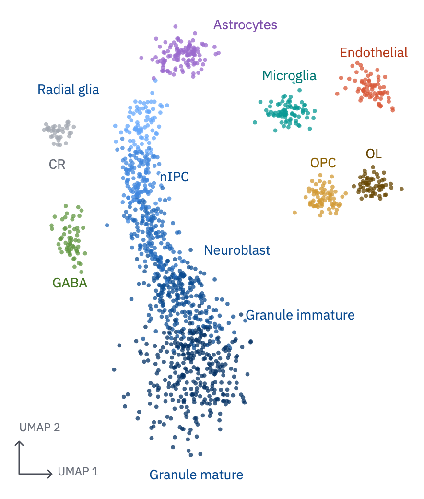
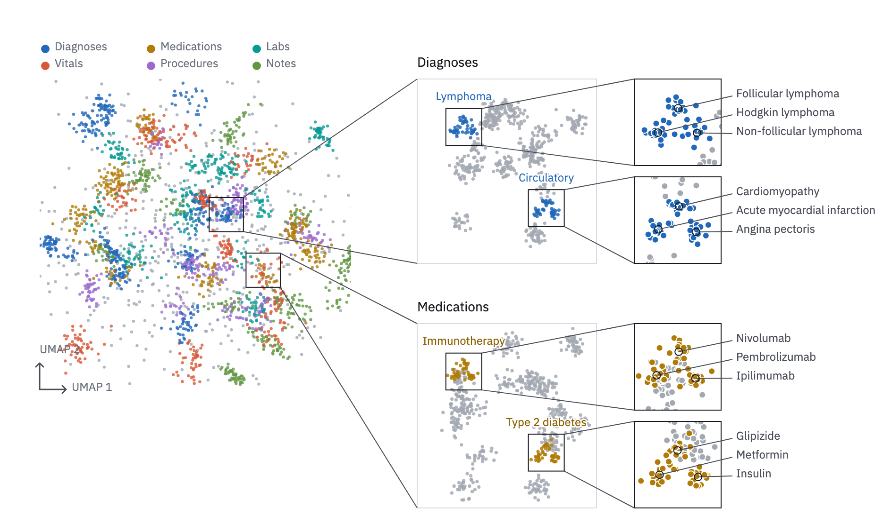

# 20 · Labelled embedding

For observations placed in a learned space (UMAP, t-SNE, a model's latent space):
cells, patients, clinical codes. Position means similarity; the coordinates mean
nothing.

- No ticks, no frame and no gridlines. An **axis stub** at the bottom-left corner,
  two 34 px `ink-2` arms with open heads, names the projection ("UMAP 1", "UMAP 2").
- Points are small and ringless (r 1.6–2.2, smaller in smaller views; 75–85 %
  opacity), drawn in shuffled order so no group always sits on top; grey points go
  first.
- **Colour** follows `../../color.md`: identity slots in order; a lineage or ordered
  states take steps of one ramp; an eighth type folds into
  `context` and keeps its name.
- **Names replace the legend.** Each group's name sits at the edge of its cloud in
  its text step, with a 3 px paper halo where it crosses points. A legend (dots and
  names, above the plot) is for when groups interleave so much that names would not
  point at one place.



```js figure=main w=442 h=520
const rnd = GA.rng(7);
const normal = (mu = 0, sd = 1) => mu + sd * Math.sqrt(-2 * Math.log(1 - rnd())) * Math.cos(2 * Math.PI * rnd());
// n points around (x, y), spread sx by sy, rotated by a (radians), in class k
const blob = (n, x, y, sx, sy, k, a = 0) => Array.from({ length: n }, () => {
  const u = normal(0, sx), v = normal(0, sy);
  return [x + u * Math.cos(a) - v * Math.sin(a), y + u * Math.sin(a) + v * Math.cos(a), k];
});
const shuffle = (a) => { for (let i = a.length - 1; i > 0; i--) { const j = Math.floor(rnd() * (i + 1)); [a[i], a[j]] = [a[j], a[i]]; } return a; };
// the lineage: points along an S-curve, staged by position along it
const stages = ["Radial glia", "nIPC", "Neuroblast", "Granule immature", "Granule mature"];
const lin = [];
for (let i = 0; i < 900; i++) {
  const t = rnd() ** 0.8, b = (p) => (1 - t) ** 3 * p[0] + 3 * (1 - t) ** 2 * t * p[1] + 3 * (1 - t) * t ** 2 * p[2] + t ** 3 * p[3];
  const X = b([3.2, 1.6, 5.4, 3.8]), Y = b([8.4, 5.6, 3.6, 1.6]);
  const k = t < 0.14 ? 0 : t < 0.3 ? 1 : t < 0.5 ? 2 : t < 0.72 ? 3 : 4;
  const w = 0.22 + 0.55 * t ** 2;
  lin.push([X + normal(0, w), Y + normal(0, w * 0.7), k]);
}
const pts = shuffle([
  ...lin,
  ...blob(120, 3.9, 9.3, 0.35, 0.2, 5, 0.3), // astrocytes
  ...blob(70, 7.2, 6.2, 0.25, 0.18, 6), ...blob(60, 8.4, 6.5, 0.22, 0.16, 7), // OPC, OL
  ...blob(80, 6.4, 8.1, 0.28, 0.2, 8), // microglia
  ...blob(70, 8.3, 8.6, 0.3, 0.18, 9, -0.4), // endothelial
  ...blob(60, 1.2, 5.3, 0.2, 0.3, 10), // GABA
  ...blob(40, 0.9, 7.6, 0.18, 0.15, -1), // Cajal-Retzius: other
]);
const colors = [...["400", "500", "600", "700", "800"].map((s) => tok(`blue-${s}`)), tok("violet-500"), tok("ochre-400"), tok("ochre-700"), tok("teal-500"), tok("vermilion-500"), tok("moss-500")];
const text = [...Array(5).fill(tok("blue-700")), tok("cat-5-text"), tok("ochre-600"), tok("ochre-700"), tok("cat-3-text"), tok("cat-4-text"), tok("cat-6-text")];
const ch = GA.chart(ga, { x: 20, y: 24, w: 440, h: 470, xd: [0, 10], yd: [0.2, 10], axes: "" });
ch.cloud(pts, colors, { r: 2.2, opacity: 0.75 });
ch.stub();
const L = (s, px, py, k, o = {}) => ch.label(s, px, py, { color: text[k], role: "tick", size: 14, halo: true, ...o });
L(stages[0], 1.9, 8.5, 0, { anchor: "end" });
L(stages[1], 3.1, 6.6, 1, { dx: 10 });
L(stages[2], 4.1, 5.0, 2, { dx: 12 });
L(stages[3], 5.0, 3.6, 3, { dx: 16 });
L(stages[4], 4.2, 0.35, 4, { anchor: "middle", dy: 2 });
L("Astrocytes", 4.6, 9.9, 5);
L("OPC", 7.2, 6.9, 6, { anchor: "middle" });
L("OL", 8.4, 7.1, 7, { anchor: "middle" });
L("Microglia", 6.4, 8.8, 8, { anchor: "middle" });
L("Endothelial", 8.4, 9.3, 9, { anchor: "middle" });
L("GABA", 1.2, 4.3, 10, { anchor: "middle" });
L("CR", 0.9, 7.1, -1, { anchor: "middle", dy: 2, color: "var(--muted)" });
```

## Atlas

When the story runs from the whole space down to single items, zoom in steps: the
overview; a subset re-embedded on its own; magnified insets of that.

- A source region is framed 1 px `ink`, and two straight 1 px `ink-2` leaders join
  its facing corners to the next view's. A re-embedded subset has a `rule` frame;
  a magnified inset an `ink` one, with its points enlarged (r 3) and ringed.
- Colour carries the top level at every zoom. In a subset, the clusters that the
  insets examine keep their colour and the rest turn `context`. Leaves are
  **named, not coloured**: callouts in one column right of the inset (`tick`,
  18–20 px apart), ordered by the points' height, each leader a 1 px `ink-2` line
  from a 1 px `ink` ring on the point.
- Each inset is named in its subset, beside its source frame, in the text step.



```js figure=atlas w=944 h=556
const rnd = GA.rng(7);
const normal = (mu = 0, sd = 1) => mu + sd * Math.sqrt(-2 * Math.log(1 - rnd())) * Math.cos(2 * Math.PI * rnd());
// n points around (x, y), spread sx by sy, rotated by a (radians), in class k
const blob = (n, x, y, sx, sy, k, a = 0) => Array.from({ length: n }, () => {
  const u = normal(0, sx), v = normal(0, sy);
  return [x + u * Math.cos(a) - v * Math.sin(a), y + u * Math.sin(a) + v * Math.cos(a), k];
});
const shuffle = (a) => { for (let i = a.length - 1; i > 0; i--) { const j = Math.floor(rnd() * (i + 1)); [a[i], a[j]] = [a[j], a[i]]; } return a; };
const X = 42, T = -26;
const mods = ["Diagnoses", "Medications", "Labs", "Vitals", "Procedures", "Notes"];
const colors = [1, 2, 3, 4, 5, 6].map((k) => tok(`cat-${k}`));
const pts = [], centres = [];
mods.forEach((_, k) => {
  for (let c = 0; c < 11; c++) {
    const a = rnd() * 2 * Math.PI, rr = 4.2 * Math.sqrt(rnd());
    const cx = 5 + rr * Math.cos(a) + (k % 3 - 1) * 0.9, cy = 5 + rr * Math.sin(a) + (k < 3 ? 0.7 : -0.7);
    centres.push([cx, cy, k]);
    pts.push(...blob(14 + Math.floor(rnd() * 40), cx, cy, 0.18 + 0.2 * rnd(), 0.12 + 0.2 * rnd(), k, rnd() * 3));
  }
});
pts.push(...blob(500, 5, 5, 2.4, 2.4, -1));
const a = GA.chart(ga, { x: X, y: T + 110, w: 330, h: 330, xd: [0, 10], yd: [0, 10], axes: "" });
a.cloud(shuffle(pts), colors, { r: 1.6, opacity: 0.8 });
a.stub({ len: 28 });
// the one legend, since six modalities interleave in the overview
mods.forEach((m, k) => {
  ga.raw(`<circle cx="${X + 6 + (k % 3) * 112}" cy="${T + 78 + Math.floor(k / 3) * 18}" r="4.5" fill="${colors[k]}"/>`);
  ga.text(m, { x: X + 16 + (k % 3) * 112, y: T + 70 + Math.floor(k / 3) * 18, role: "tick", size: 12 });
});
// a region around the cluster of modality k nearest a point on the overview's right,
// so the leaders run short and the upper region feeds the upper subset
const near = (k, px, py) => centres.filter((c) => c[2] === k).sort((p, q) => Math.hypot(p[0] - px, p[1] - py) - Math.hypot(q[0] - px, q[1] - py))[0];
const sub = [
  { k: 0, name: "Diagnoses", insets: [
    { name: "Lymphoma", leaves: ["Hodgkin lymphoma", "Follicular lymphoma", "Non-follicular lymphoma"] },
    { name: "Circulatory", leaves: ["Acute myocardial infarction", "Cardiomyopathy", "Angina pectoris"] } ] },
  { k: 1, name: "Medications", insets: [
    { name: "Immunotherapy", leaves: ["Pembrolizumab", "Nivolumab", "Ipilimumab"] },
    { name: "Type 2 diabetes", leaves: ["Metformin", "Glipizide", "Insulin"] } ] },
];
const BX = X + 400, BW = 190, BH = 196, IX = BX + BW + 40, IW = 92;
sub.forEach((s, j) => {
  const c = near(s.k, 8, j ? 3 : 7.5), rg = a.region(c[0] - 0.55, c[0] + 0.55, c[1] - 0.55, c[1] + 0.55);
  const by = T + 110 + j * (BH + 64);
  ga.text(s.name, { x: BX, y: by - 24, role: "label", size: 14, color: "var(--ink)" });
  // the subset, re-embedded: its insets' clusters in the modality's colour, the rest grey
  const b = GA.chart(ga, { x: BX, y: by, w: BW, h: BH, xd: [0, 10], yd: [0, 10], axes: "" });
  b.frame({ color: "var(--rule)" });
  GA.leaders(ga, rg, { x0: BX, y0: by, x1: BX + BW, y1: by + BH });
  const spots = [[2.6, 7.4], [7.2, 3.0]];
  const bp = [];
  for (let q = 0; q < 16; q++) bp.push(...blob(20 + Math.floor(rnd() * 30), 1 + 8 * rnd(), 1 + 8 * rnd(), 0.35, 0.3, -1, rnd() * 3));
  const leafPts = spots.map(([sx0, sy0]) => [0, 1, 2].map((l) => blob(16, sx0 + (l - 1) * 0.45, sy0 + (l % 2 ? 0.35 : -0.25), 0.16, 0.14, s.k)));
  leafPts.forEach((ls) => ls.forEach((p) => bp.push(...p)));
  b.cloud(shuffle(bp), colors, { r: 1.8, opacity: 0.85 });
  s.insets.forEach((ins, i) => {
    const [sx0, sy0] = spots[i];
    const src = b.region(sx0 - 1, sx0 + 1, sy0 - 1, sy0 + 1);
    const iy = by + i * (BH - IW);
    const inset = GA.chart(ga, { x: IX, y: iy, w: IW, h: IW, xd: [sx0 - 1, sx0 + 1], yd: [sy0 - 1, sy0 + 1], axes: "" });
    GA.leaders(ga, src, { x0: IX, y0: iy, x1: IX + IW, y1: iy + IW });
    inset.cloud(bp.filter((p) => Math.abs(p[0] - sx0) < 1.05 && Math.abs(p[1] - sy0) < 1.05), colors, { r: 3, ring: true });
    inset.frame();
    b.label(ins.name, sx0, sy0 + 1, { anchor: "middle", role: "tick", size: 12, color: tok(`cat-${s.k + 1}-text`), halo: true, dy: -18 });
    const cen = leafPts[i].map((p) => [p.reduce((u, q) => u + q[0], 0) / p.length, p.reduce((u, q) => u + q[1], 0) / p.length]);
    inset.callouts(cen.map((q, l) => ({ x: q[0], y: q[1], label: ins.leaves[l] })), { x: IX + IW + 16, y: iy + 18, pitch: 20 });
  });
});
```

## In each format

| Element | Canvas | Print |
|---|---|---|
| Embedding point | r 2, no ring | r 0.6 pt, no ring |
| Magnified inset point | r 3, 1 px paper ring | r 1 pt, 0.25 pt paper ring |
| Zoom frame and leaders | 1 px | 0.25 pt, ink and ink-2 |

**Magnified insets in print.** An inset zooms a dense region of a plot or of an
embedding into a second plot area beside it (the atlas above; a scatter's dense
corner), inside the publication panel contract.

| Distance | mm |
|---|---|
| Inset side (square; at least twice the source region's side) | 15–25 |
| Inset to the next inset, stacked | 2.0 |
| Inset to its callout column | 2.5 |
| Callout pitch | 3.0 |

- The source region is framed 0.25 pt ink; two straight 0.25 pt ink-2 leaders join
  its facing corners to the inset's, and cross nothing but the plot they leave.
- An inset of a chart keeps two ticks per axis, at its start and end, so its scale
  reads; an inset of an embedding has none.
- Insets sit in the same panel as their source, under one letter.
