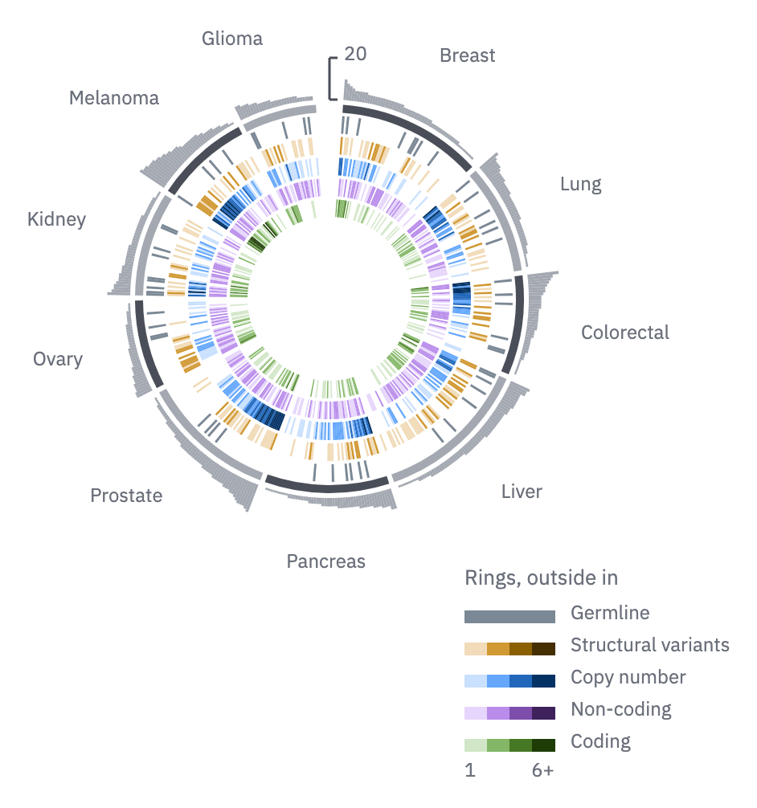

# 21 · Radial track stack

For many variables across thousands of individuals in groups: the drivers of every
patient in a pan-cancer cohort. It is the oncoprint (07) bent into a circle, so a
long axis of individuals fits a square panel. Use it to show a cohort's shape at a
glance; for data the reader must evaluate, use the oncoprint.

- Individuals run clockwise from 12 o'clock, one angular slice each, in **sectors**
  by group with a 1.5° gap between sectors. An 8° opening at 12 o'clock holds the
  scale. Within a sector, sort individuals by the outer bar.
- From the outside in: the **bar ring** (26 px deep, `context`, one bar per
  individual, its scale running to a round number at or above the peak, labelled
  once on a short axis in the opening); the **sector ring** (5 px, `ink-2` and
  `context` alternating); then one **heat ring** per variable (11–12 px deep, 2 px
  paper gaps).
- Each heat ring takes its own hue's ramp (steps 200–800 for counts; one step for
  present or absent). Zero stays paper. Hues follow the categorical order, and the
  ring's order is the key's order.
- Sector names sit outside the bar ring in the `tick` role, reading horizontally:
  standing on the ring at the top, hanging from it at the bottom, level with it at
  the sides.
- The **ring key** lists the rings outside in, each a short ramp strip and its name,
  with the strips' end values under the last one. The centre stays empty.



```js figure=main w=471 h=503
const rnd = GA.rng(47);
const X = 16, T = -76;
const types = ["Breast", "Lung", "Colorectal", "Liver", "Pancreas", "Prostate", "Ovary", "Kidney", "Melanoma", "Glioma"];
const sizes = [58, 44, 40, 62, 50, 54, 36, 42, 38, 30];
const R = GA.radial(ga, { cx: X + 189, cy: T + 262, r: 116, groups: types.map((l, k) => ({ label: l, n: sizes[k] })) });
// per patient: counts of five driver classes; the bar ring is their sum
const pts = [];
sizes.forEach((n, k) => {
  const grp = Array.from({ length: n }, () => {
    const v = [rnd() < 0.15 ? 1 : 0, Math.floor(rnd() * rnd() * 4), Math.floor(rnd() * (2 + (k % 3)) * rnd() * 3), Math.floor(rnd() * 3), Math.floor(rnd() * rnd() * (k === 8 ? 10 : 5))];
    return { v, tot: v.reduce((a, b) => a + b, 0) };
  }).sort((a, b) => b.tot - a.tot);
  pts.push(...grp);
});
R.sectors({ depth: 5, labelR: 116 + 5 + 3 + 26 + 8 });
R.bars(pts.map((p) => p.tot), { r0: 116 + 5 + 3, depth: 26 });
// germline is present or absent: one step; counts take four steps of their hue
const steps = [200, 400, 600, 800];
const rings = [
  { label: "Germline", ramp: ramp("slate", [500]) }, { label: "Structural variants", ramp: ramp("ochre", steps) }, { label: "Copy number", ramp: ramp("blue", steps) },
  { label: "Non-coding", ramp: ramp("violet", steps) }, { label: "Coding", ramp: ramp("moss", steps) },
];
rings.forEach((rg, k) => R.ring(pts.map((p) => p.v[k]), rg.ramp, { depth: 11, domain: [1, k === 0 ? 1 : 6] }));
R.key(rings, { x: X + 273, y: T + 452, w: 56, lo: "1", hi: "6+" });
ga.text("Rings, outside in", { x: X + 273, y: T + 430, role: "tick", color: "var(--muted)" });
```

## In each format

**In print** the radial stack is square: the circle and its sector names fill the
cell's width, and the ring key sits in a corner the circle leaves free.

| Distance | mm |
|---|---|
| Bar ring depth | 4.0 |
| Sector ring depth | 0.8 |
| Heat ring depth | 1.5–2.0 |
| Between rings | 0.3 |
| Sector gap / opening at 12 o'clock | 1.5° / 8° |
| Sector name to the bar ring | 1.5 |

- The inner radius stays at least 40 % of the outer, so the innermost ring's slices
  keep their width; drop rings before shrinking it.
