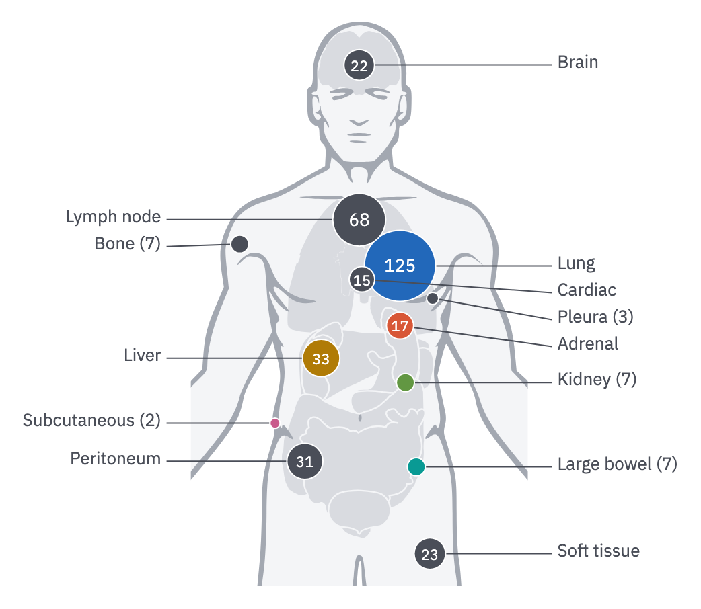
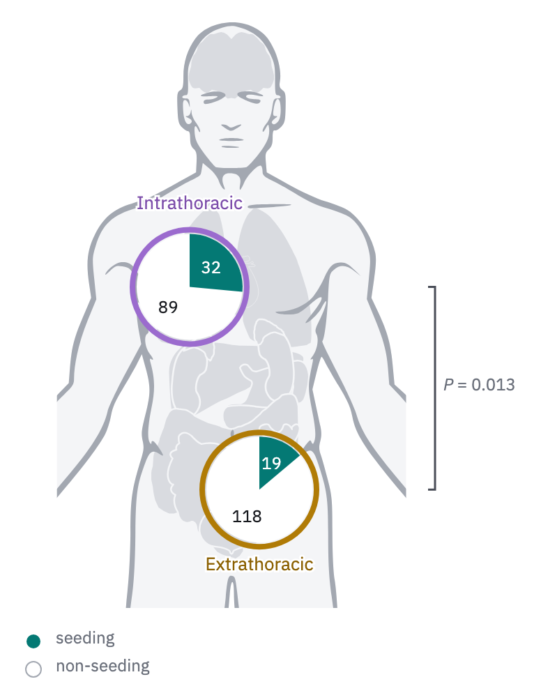

# 22 · Body map

For counts per anatomical site: metastases by organ, samples by site, lesions by
region. The body gives the sites their places, so no axis is needed.

- The body is neutral (`../../illustration.md`, *Body maps*): wash fill, `context`
  outline, organs in `rule`. The patient's right is the viewer's left.
- **Site bubbles**: one circle per site at its place, **area** proportional to the
  count, the count inside in paper (13 px, or 11 px in small bubbles). Bigger
  bubbles are drawn first, each with a 1 px paper ring, so overlapping sites stay
  apart.
- Colour follows the site: a registered organ keeps its entity colour (`../../color.md`,
  *Entities*); any other site is `ink-2`. Register a site that recurs across figures
  before it needs a colour.
- Names sit in two columns beside the body, the patient's right side on the left,
  each on a 1 px `ink-2` leader from the bubble's edge, pushed apart to one line
  pitch in height order so leaders do not cross. A bubble too small to hold its
  count puts it after its name ("Bone (7)").



```js figure=main w=521 h=453
const B = GA.bio(ga);
const body = B.body({ cx: 267, y: 16, h: 420 });
const org = (n) => tok(`organ-${n}`), ink2 = tok("ink-2");
B.bubbles(body, [
  { site: "brain", n: 22, color: ink2, label: "Brain" },
  { site: "lymph node", n: 68, color: ink2, label: "Lymph node", side: "l" },
  { site: "lung L", n: 125, color: org("lungs"), label: "Lung" },
  { site: "bone", n: 7, color: ink2, label: "Bone" },
  { site: "cardiac", n: 15, color: ink2, label: "Cardiac" },
  { site: "pleura", n: 3, color: ink2, label: "Pleura" },
  { site: "liver", n: 33, color: org("liver"), label: "Liver" },
  { site: "adrenal", n: 17, color: org("adrenal"), label: "Adrenal" },
  { site: "kidney", n: 7, color: org("kidney"), label: "Kidney" },
  { site: "peritoneum", n: 31, color: ink2, label: "Peritoneum" },
  { site: "large bowel", n: 7, color: org("colon"), label: "Large bowel" },
  { site: "soft tissue", n: 23, color: ink2, label: "Soft tissue" },
  { site: "subcutaneous", n: 2, color: org("skin"), label: "Subcutaneous" },
], { rmax: 26, max: 125 });
```

## Region dials

To compare a share between regions (intrathoracic against extrathoracic), draw one
dial per region instead of bubbles per site.

- A dial is a paper disc with a 4 px ring in the region's colour, a wedge for the
  share filled clockwise from 12 o'clock, and both counts inside.
- The region's name sits beside its dial in its text step, on a paper halo, and a
  test between regions on a bracket beside them.



```js figure=region-dials w=388 h=502
const B = GA.bio(ga);
const body = B.body({ cx: 166, y: 16, h: 420 });
const intra = { x: 136, y: body.site("lung R").y + 8 }, extra = { x: 186, y: body.site("small bowel").y + 12 };
B.dial({ ...intra, r: 38, share: [32, 121], ring: tok("cat-5"), color: tok("teal-600") });
B.dial({ ...extra, r: 38, share: [19, 137], ring: tok("cat-2"), color: tok("teal-600") });
// each region named beside its dial, in its text step, on a paper halo
const name = (str, p, dy, k) => {
  const it = ga.text(str, { x: p.x, y: p.y + dy, role: "tick", size: 13, anchor: "middle", color: tok(`cat-${k}-text`) });
  it.node.querySelectorAll("text").forEach((t) => t.setAttribute("style", `${t.getAttribute("style")};stroke:var(--paper);stroke-width:3px;paint-order:stroke`));
};
name("Intrathoracic", intra, -66, 5);
name("Extrathoracic", extra, 48, 2);
// the test between the two regions, as a bracket beside them
const bx = 312;
ga.raw(`<path d="M${bx - 5} ${intra.y}H${bx}V${extra.y}H${bx - 5}" stroke="var(--ink-2)" stroke-width="1.5" fill="none"/>`);
ga.text("*P* = 0.013", { x: bx + 6, y: (intra.y + extra.y) / 2 - 8, role: "tick", size: 12 });
GA.glyphKey(ga, [{ kind: "circle", fill: tok("teal-600"), label: "seeding" }, { kind: "circle", fill: "var(--paper)", ring: "var(--context)", ringW: 1, label: "non-seeding" }], { x: 16, y: body.bottom + 16 });
```

## In each format

| Element | Canvas | Print |
|---|---|---|
| Body | 420–440 px tall, head to upper thighs | 45–70 mm tall; site names 6 pt |
