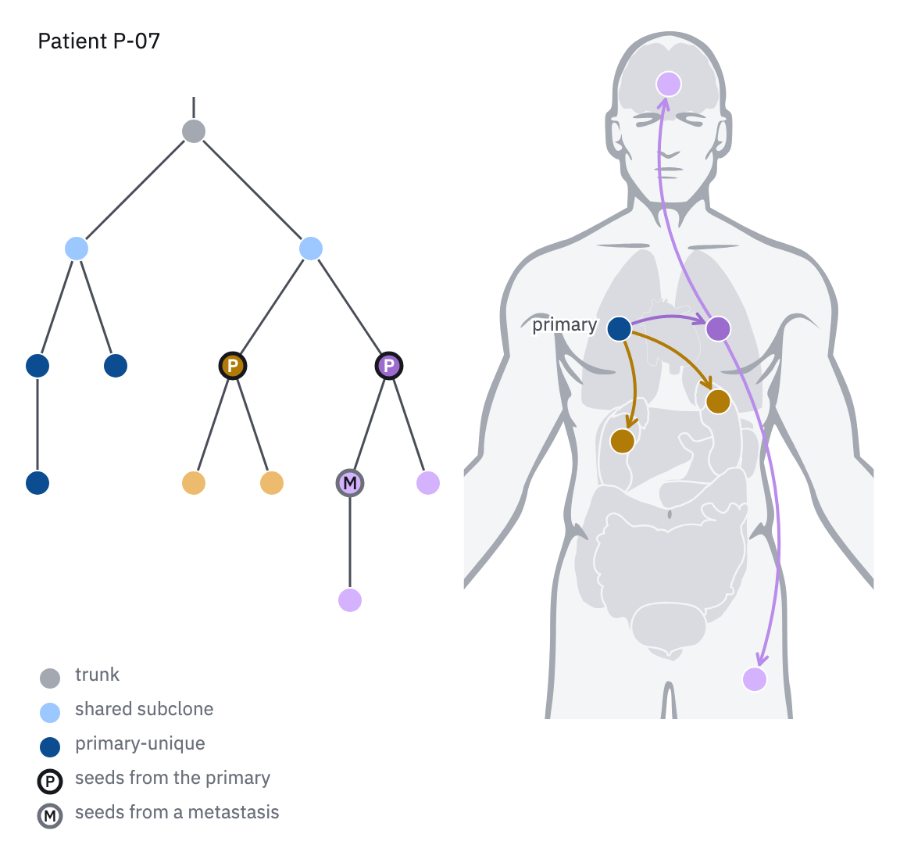

# 23 · Route map

For where a tumour spread and from where: seeding routes in one patient, drawn on
the body map (22).

- Sites are drawn as the clone tree's nodes (24), so the pair shares one vocabulary:
  16 px dots with a 1 px paper ring. The primary is filled with the primary-unique
  class (`blue-700`) and named "primary"; each metastasis is filled with the colour
  of the lineage that seeded it. Role rings and letters (P, M) stay on the tree.
- A route is a 2 px arrow with an open head from the source site to the seeded site,
  in the lineage's colour. Every route bows to the left of its direction of travel by
  a quarter of its length, so routes that share an end fan out instead of stacking,
  and each stops short of its target so the dot stays whole (a 10 px gap).
- **One hue per seeding lineage** (the categorical slots not already used by the
  location classes: ochre, violet, rose), its 500 step for the clone that seeded
  from the primary and a lighter step (300 for dots, 400 for arrows) for its
  descendants that seeded again from a metastasis.
- Set the route map beside the lineage's clone tree (24); the two share colours, so
  no key is needed for the lineages.



```js figure=main w=576 h=545
const X = 24, T = 84;
const B = GA.bio(ga);
ga.text("Patient P-07", { x: X, y: 20, role: "label", size: 14, color: "var(--ink)" });
// location classes (where a clone lives) and seeding lineages (who seeded where)
const trunk = tok("context"), shared = tok("blue-300"), prim = tok("blue-700");
const A = tok("cat-2"), A2 = tok("ochre-300"), Bv = tok("cat-5"), B2 = tok("violet-300");
GA.cloneTree(ga, {
  x: X, y: T, w: 250, h: 300,
  root: { id: "t", fill: trunk, children: [
    { id: "s1", fill: shared, children: [{ id: "p1", fill: prim, children: [{ id: "p2", fill: prim }] }, { id: "p3", fill: prim }] },
    { id: "s2", fill: shared, children: [
      { id: "A", fill: A, role: "P", children: [{ id: "a1", fill: A2 }, { id: "a2", fill: A2 }] },
      { id: "B", fill: Bv, role: "P", children: [{ id: "BM", fill: B2, role: "M", textColor: "var(--ink)", children: [{ id: "b1", fill: B2 }] }, { id: "b2", fill: B2 }] },
    ] },
  ] },
});
GA.glyphKey(ga, [
  { kind: "circle", size: 14, fill: trunk, label: "trunk" },
  { kind: "circle", size: 14, fill: shared, label: "shared subclone" },
  { kind: "circle", size: 14, fill: prim, label: "primary-unique" },
  { kind: "circle", size: 14, fill: "var(--paper)", ring: "var(--ink)", ringW: 2.5, text: "P", textColor: "var(--ink)", label: "seeds from the primary" },
  { kind: "circle", size: 14, fill: "var(--paper)", ring: "var(--muted)", ringW: 2.5, text: "M", textColor: "var(--ink)", label: "seeds from a metastasis" },
], { x: X, y: T + 342, pitch: 22 });
// the route map: the primary and each metastasis as the tree's dots, routes in the lineage's colour
const body = B.body({ cx: X + 404, y: 20, h: 440 });
const s = (n) => body.site(n);
const mets = [{ site: "liver", c: A }, { site: "adrenal", c: A }, { site: "lung L", c: Bv }, { site: "brain", c: B2 }, { site: "soft tissue", c: B2 }];
GA.routes(ga, [
  { from: s("lung R"), to: s("liver"), color: A }, { from: s("lung R"), to: s("adrenal"), color: A },
  { from: s("lung R"), to: s("lung L"), color: Bv }, { from: s("lung L"), to: s("brain"), color: tok("violet-400") }, { from: s("lung L"), to: s("soft tissue"), color: tok("violet-400") },
], { bow: 0.22, gap: 10 });
let dots = mets.map((m) => GA.glyph("circle", s(m.site).x, s(m.site).y, { size: 16, fill: m.c })).join("");
dots += GA.glyph("circle", s("lung R").x, s("lung R").y, { size: 16, fill: prim });
ga.raw(dots);
const pl = ga.text("primary", { x: s("lung R").x - 14, y: s("lung R").y - 8, role: "tick", size: 12, anchor: "end", color: "var(--ink-2)" });
pl.node.querySelectorAll("text").forEach((t) => t.setAttribute("style", `${t.getAttribute("style")};stroke:var(--paper);stroke-width:3px;paint-order:stroke`));
```

## In each format

| Element | Canvas | Print |
|---|---|---|
| Route arrow | 2 px, open head | 0.75 pt, 1.5 mm head |
| Body | 420–440 px tall, head to upper thighs | 45–70 mm tall; site names 6 pt |
