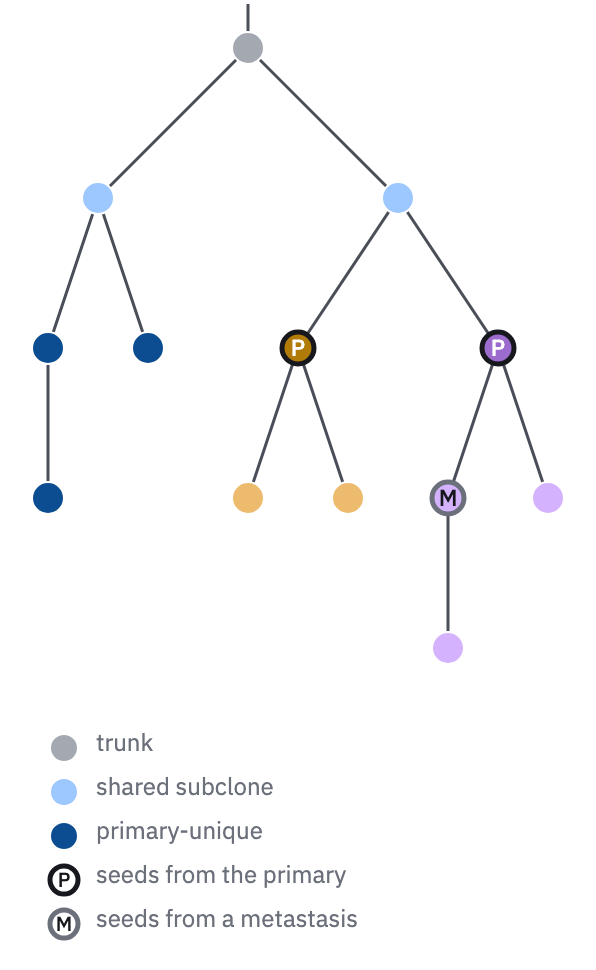

# 24 · Clone tree

For a tumour's phylogeny: which subclones exist, where each lives, and which seeded
metastases.

- The root sits on a short stem at the top; edges are straight 1.5 px `ink-2` lines;
  leaves take equal slots across the width and a parent sits over the middle of its
  children.
- Nodes are 16 px circle glyphs (*Glyphs*). **Fill is where the clone lives**:
  trunk `context`, shared `blue-300`, primary-unique `blue-700`, metastasis-unique
  `teal-500`. Beside a route map, seeding clones and their metastatic descendants
  take their lineage's colour instead (23), and the route map draws its sites with
  the same dots, so a fill means the same clone in both panels.
- **Ring and letter are its seeding role**: P with a 2.5 px `ink` ring for a clone
  that seeds from the primary, M with a 2.5 px `muted` ring for one that seeds from a
  metastasis.
- The key lists the location classes and the two roles, drawn as glyphs.



```js figure=main w=298 h=485
const X = 24, T = 24;
// location classes (where a clone lives) and seeding lineages (who seeded where)
const trunk = tok("context"), shared = tok("blue-300"), prim = tok("blue-700");
const A = tok("cat-2"), A2 = tok("ochre-300"), Bv = tok("cat-5"), B2 = tok("violet-300");
GA.cloneTree(ga, {
  x: X, y: T, w: 250, h: 300,
  root: { id: "t", fill: trunk, children: [
    { id: "s1", fill: shared, children: [{ id: "p1", fill: prim, children: [{ id: "p2", fill: prim }] }, { id: "p3", fill: prim }] },
    { id: "s2", fill: shared, children: [
      { id: "A", fill: A, role: "P", children: [{ id: "a1", fill: A2 }, { id: "a2", fill: A2 }] },
      { id: "B", fill: Bv, role: "P", children: [{ id: "BM", fill: B2, role: "M", textColor: "var(--ink)", children: [{ id: "b1", fill: B2 }] }, { id: "b2", fill: B2 }] },
    ] },
  ] },
});
GA.glyphKey(ga, [
  { kind: "circle", size: 14, fill: trunk, label: "trunk" },
  { kind: "circle", size: 14, fill: shared, label: "shared subclone" },
  { kind: "circle", size: 14, fill: prim, label: "primary-unique" },
  { kind: "circle", size: 14, fill: "var(--paper)", ring: "var(--ink)", ringW: 2.5, text: "P", textColor: "var(--ink)", label: "seeds from the primary" },
  { kind: "circle", size: 14, fill: "var(--paper)", ring: "var(--muted)", ringW: 2.5, text: "M", textColor: "var(--ink)", label: "seeds from a metastasis" },
], { x: X, y: T + 342, pitch: 22 });
```

## In each format

| Element | Canvas | Print |
|---|---|---|
| Role ring | 2.5 px | 1 pt |
