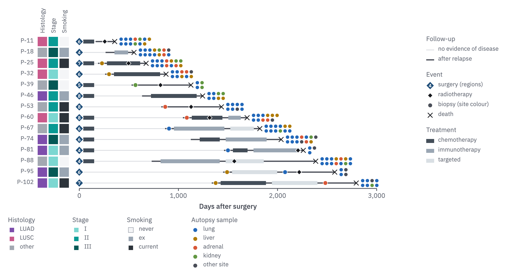

# 25 · Swimmer plot

For a cohort's clinical course: one row per patient on a shared time axis. Form 17
is one patient's record in depth; the swimmer plot is every patient's in outline.

- Rows sort by survival (or follow-up), shortest first. The follow-up line runs from
  time 0 to the row's end and **carries the disease state**: 1.5 px `rule` until
  relapse, 2.5 px `ink-2` after it. A death ends the row with an x.
- Few glyphs (*Glyphs*): surgery a `prussian` diamond with the number of regions
  sampled inside; radiotherapy a small `ink` diamond; every sample a circle.
- Treatments, adjuvant ones included, are 8 px bars on the line, square-cornered.
- **Every sample is a circle in its site's colour, as on the body map** (22):
  biopsies sit on the line when they were taken; samples taken at the end (autopsy)
  sit after the row's end, two rows deep. Colour then has one job, the site, so
  treatment bars take slate steps (700, 400, 200) and annotation strips use hues that
  no site in the figure uses.
- Annotation strips (histology, stage, smoking) are squares left of the plot, one
  column each, named upward above it; the patient's label sits left of them.
- Keys beside the plot: the two line states, the events, the treatments. Strips and
  sample sites beneath it.



```js figure=main w=1023 h=558
const rnd = GA.rng(11);
const X = 16, T = -23;
// colour has one job here: the sampled site, as on the body map (form 22)
const site = { lung: tok("organ-lungs"), liver: tok("organ-liver"), adrenal: tok("organ-adrenal"), kidney: tok("organ-kidney"), other: tok("ink-2") };
const siteKeys = Object.keys(site);
// treatments are slate steps; the strips use hues no site uses here
const tx = { chemo: tok("slate-700"), immuno: tok("slate-400"), targeted: tok("slate-200") };
const histo = [tok("violet-600"), tok("rose-500"), tok("context")], stage = [tok("teal-300"), tok("teal-500"), tok("teal-700")], smoke = [tok("wash"), tok("slate-400"), tok("slate-800")];
const n = 14, rows = [];
for (let i = 0; i < n; i++) {
  const end = Math.round(300 + (2600 * (i + rnd() * 0.6)) / n), rel = Math.round(end * (0.25 + 0.4 * rnd()));
  const events = [{ t: 0, kind: "diamond", fill: "var(--prussian)", text: String(2 + Math.floor(rnd() * 7)), size: 13 }];
  const bars = [];
  if (rnd() < 0.6) bars.push({ t0: 40, t1: 150, color: tx.chemo }); // adjuvant chemotherapy
  // a biopsy at relapse: a sample, so a circle in its site's colour, on the line
  if (rnd() < 0.7) events.push({ t: rel + 40, kind: "circle", fill: site[siteKeys[Math.floor(rnd() * siteKeys.length)]], size: 9 });
  let t0 = rel + 90;
  for (const k of ["chemo", "immuno", "targeted"]) {
    if (rnd() < 0.55 && t0 < end - 120) { const t1 = Math.min(end - 60, t0 + 100 + rnd() * 500); bars.push({ t0, t1, color: tx[k] }); t0 = t1 + 60; }
  }
  if (rnd() < 0.5 && t0 < end - 60) events.push({ t: t0 + 20, kind: "circle", fill: site[siteKeys[Math.floor(rnd() * siteKeys.length)]], size: 9 });
  if (rnd() < 0.6) events.push({ t: Math.round(rel + (end - rel) * rnd()), kind: "diamond", fill: "var(--ink)", size: 8 });
  const ns = 3 + Math.floor(rnd() * 12);
  const samples = Array.from({ length: ns }, (_, k) => site[siteKeys[k < ns * 0.4 ? 0 : Math.floor(rnd() * siteKeys.length)]]);
  rows.push({ label: `P-${String(11 + i * 7).padStart(2, "0")}`, end, dead: true, relapse: rel, events, bars, samples, strips: [histo[Math.floor(rnd() * 3)], stage[Math.floor(rnd() * 3)], smoke[Math.floor(rnd() * 3)]] });
}
const X0 = X + 144, pitch = 22;
const ch = GA.chart(ga, { x: X0, y: T + 96, w: 600, h: n * pitch, xd: [0, 3000], xTicks: [0, 1000, 2000, 3000], xFmt: (v) => v.toLocaleString("en-GB"), xTitle: "Days after surgery", axes: "x" });
ch.swimmer(rows, { stripX: [X + 60, X + 60 + pitch, X + 60 + 2 * pitch], stripLabels: ["Histology", "Stage", "Smoking"] });
// keys: follow-up, events and treatment right of the plot; strips and samples beneath
const kx = X0 + 700;
let ky = GA.glyphKey(ga, [
  { line: { color: "var(--rule)", width: 1.5 }, label: "no evidence of disease" },
  { line: { color: "var(--ink-2)", width: 2.5 }, label: "after relapse" },
], { x: kx, y: T + 96, title: "Follow-up" });
ky = GA.glyphKey(ga, [
  { kind: "diamond", fill: "var(--prussian)", text: "4", size: 13, label: "surgery (regions)" },
  { kind: "diamond", fill: "var(--ink)", size: 8, label: "radiotherapy" },
  { kind: "circle", fill: "var(--ink-2)", size: 9, label: "biopsy (site colour)" },
  { kind: "x", size: 11, label: "death" },
], { x: kx, y: ky + 12, title: "Event" });
GA.glyphKey(ga, [{ bar: tx.chemo, label: "chemotherapy" }, { bar: tx.immuno, label: "immunotherapy" }, { bar: tx.targeted, label: "targeted" }], { x: kx, y: ky + 12, title: "Treatment" });
const key = (title, labels, cols, xx) => GA.glyphKey(ga, labels.map((l, i) => ({ kind: "square", fill: cols[i], size: 10, ring: cols[i] === tok("wash") ? "var(--context)" : undefined, ringW: 1, label: l })), { x: xx, y: ch.y1 + 58, pitch: 18, title });
key("Histology", ["LUAD", "LUSC", "other"], histo, X);
key("Stage", ["I", "II", "III"], stage, X + 130);
key("Smoking", ["never", "ex", "current"], smoke, X + 240);
GA.glyphKey(ga, siteKeys.map((k) => ({ kind: "circle", fill: site[k], size: 9, label: k === "other" ? "other site" : k })), { x: X + 370, y: ch.y1 + 58, pitch: 18, title: "Autopsy sample" });
```

## In each format

| Element | Canvas | Print |
|---|---|---|
| Treatment bar | 8 px | 1.8 mm |
