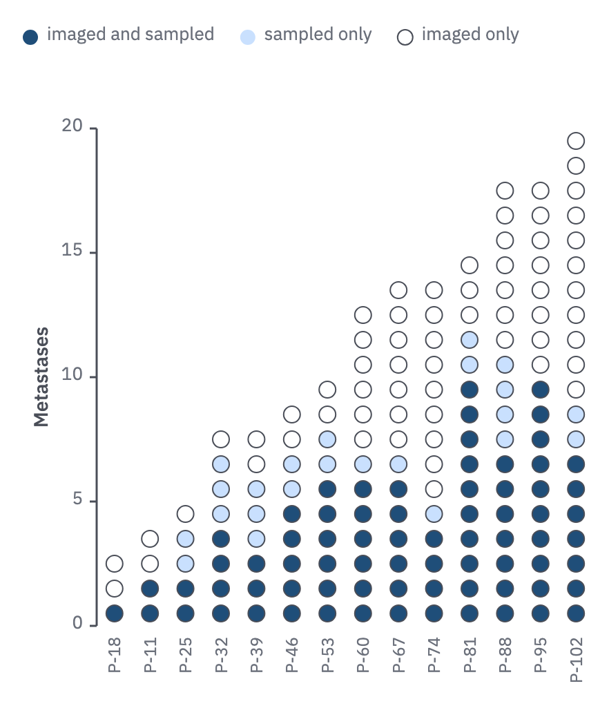

# 26 · Unit columns

For a few items per unit when each item has a state: metastases per patient, imaged
and sampled or not.

- One dot per item (r 6, 1 px `ink-2` ring), stacked into a column per unit. The y
  axis counts items, so a column's height is its total.
- States stack in one fixed order from the baseline up, darkest first; the lightest
  state is hollow (paper fill, ring only).
- Columns sort by total; unit names hang below the axis, reading upward.
- A key of the states sits above the plot, in stack order.
- Past about 30 items per column, use stacked bars (08) instead.



```js figure=main w=441 h=511
const rnd = GA.rng(13);
const X = 16, T = -7;
const cols = Array.from({ length: 14 }, (_, j) => {
  const tot = 2 + Math.round(j * 1.25 + rnd() * 3), both = Math.round(tot * (0.3 + 0.4 * rnd())), smp = Math.round((tot - both) * rnd());
  return { label: `P-${String(11 + j * 7).padStart(2, "0")}`, parts: [both, smp, tot - both - smp], tot };
}).sort((a, b) => a.tot - b.tot);
const ch = GA.chart(ga, { x: X + 54, y: T + 100, w: 360, h: 360, xd: [-0.5, 13.5], yd: [0, 20], yTicks: [0, 5, 10, 15, 20], yTitle: "Metastases", axes: "y" });
ch.units(cols, [tok("prussian"), tok("blue-200"), "hollow"]);
// the key above the plot, in stack order; the hollow state drawn as its dot
const kx = ch.dotKey([{ label: "imaged and sampled", color: tok("prussian") }, { label: "sampled only", color: tok("blue-200") }], { x: X, y: T + 26 });
ga.raw(GA.glyph("circle", kx + 6, T + 34, { size: 11, fill: "var(--paper)", ring: "var(--ink-2)", ringW: 1 }));
ga.text("imaged only", { x: kx + 18, y: T + 26, role: "tick" });
```

## In each format

| Element | Canvas | Print |
|---|---|---|
| Unit dot | r 6, 1 px `ink-2` ring | r 1.3 mm, 0.25 pt ring |
